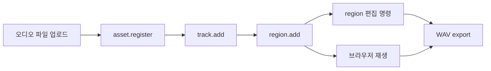
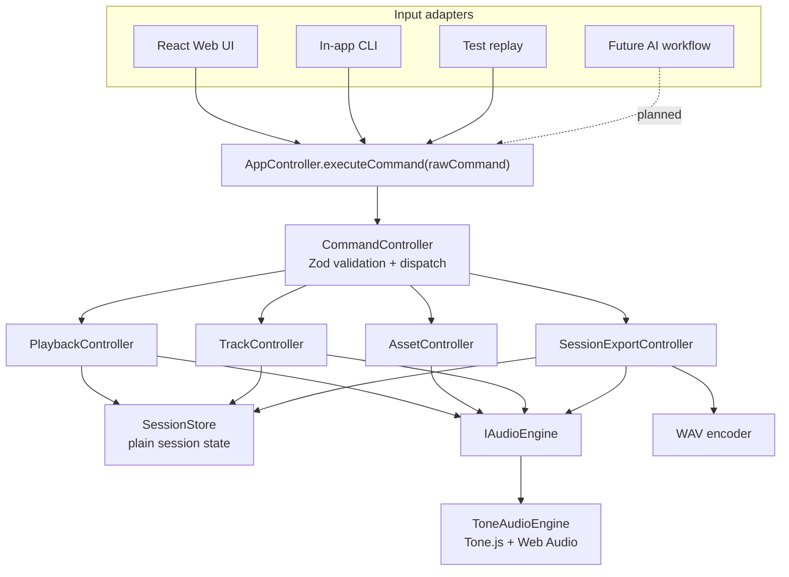
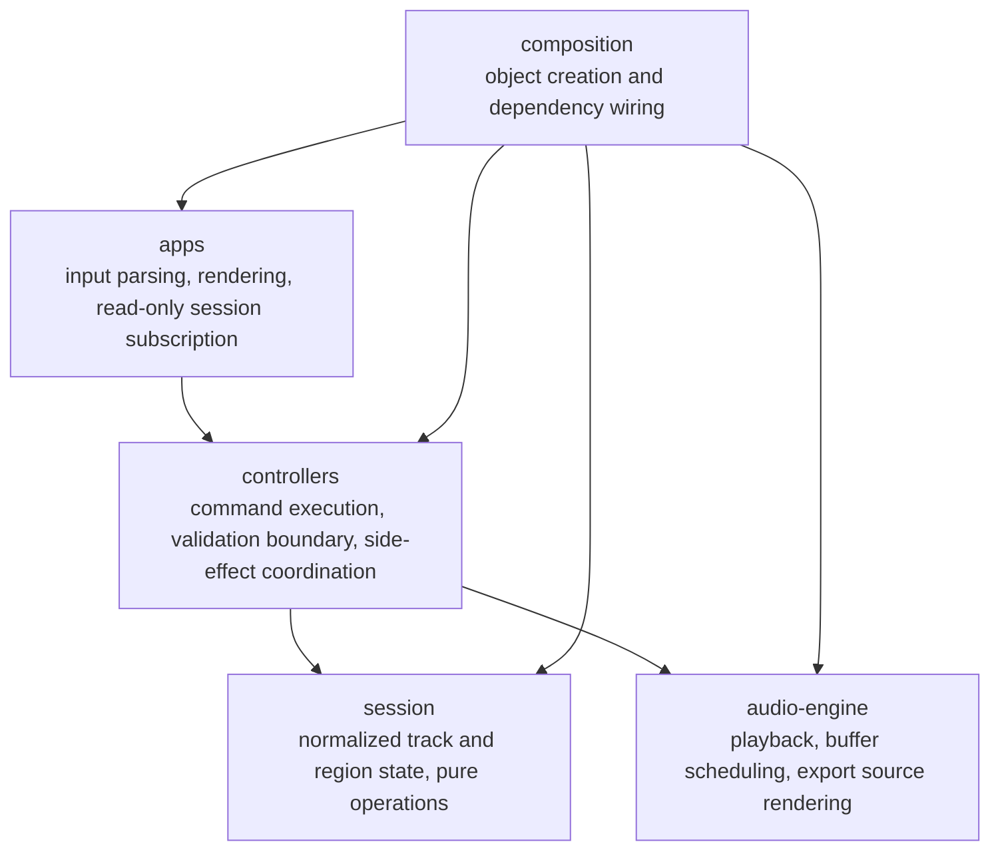

# Drop AI v3

Drop AI v3는 브라우저에서 오디오 파일을 업로드하고, 재생하고, region을 편집하고, WAV로 export할 수 있는 lightweight DAW(Digital Audio Workstation)입니다.

이 프로젝트가 증명하려는 것은 "멋진 구조"가 아닙니다. 사용자가 실제 소리를 듣고, 편집 결과를 확인하고, export 가능한 결과물을 얻는 흐름입니다.

다만 DAW는 입력 경로가 빨리 늘어나는 제품입니다. 버튼, 단축키, 인앱 CLI, 테스트 replay, 향후 AI workflow가 모두 같은 편집 의도를 만들 수 있습니다. Drop AI v3는 이 입력들을 하나의 command 실행 경계로 모아, UI와 오디오 엔진이 서로를 직접 침범하지 않도록 설계합니다.

> 사람이 실제 오디오 작업을 끝낼 수 있고, 여러 입력 경로가 같은 편집 코어를 공유하는 browser DAW.

## What Works Now

현재 구현은 제품 완성본이 아니라 실제 오디오 vertical slice를 고정하는 단계입니다.

완료된 흐름:



현재 가능한 작업:

- 오디오 파일 업로드 후 기본 asset, track, region을 생성합니다.
- `ToneAudioEngine`으로 실제 AudioContext 실행과 buffer source scheduling을 수행합니다.
- CLI 없이 play, pause, stop, seek를 실행할 수 있는 최소 transport UI가 있습니다.
- 인앱 CLI에서 region move, split, resize 명령을 실행할 수 있습니다.
- `session.export` / `export` 명령으로 실제 오디오 샘플을 담은 WAV Blob을 생성하고 다운로드합니다.
- command 정의를 `command-registry.ts`에 모아 parser와 `commands` 출력이 같은 registry를 사용합니다.

아직 제품 기준으로 부족한 부분:

- timeline/waveform 기반 직접 편집 UI는 아직 없습니다.
- transport playhead가 재생 중 실시간으로 진행되지는 않습니다.
- 프로젝트 저장/복원은 아직 없습니다.

## Product Philosophy

### 1. 작동하는 오디오가 먼저입니다

이 프로젝트에서 구조는 목적이 아니라 수단입니다. command boundary, controller, adapter가 잘 나뉘어 있어도 실제 파일이 재생되지 않거나 export 결과가 비어 있으면 DAW로서 실패한 것입니다.

그래서 우선순위는 다음 순서를 따릅니다.

1. 실제 오디오 업로드와 재생
2. 실제 region 편집 반영
3. 실제 WAV export
4. session과 asset 저장 계약 확정
5. IndexedDB 기반 save/load

### 2. Command-first는 내부 실행 계약입니다

`command-first`는 사용자에게 보이는 기능명이 아닙니다. 편집 의도를 `type`과 `payload`를 가진 plain object로 표현하고, 모든 쓰기 입력이 `AppController.executeCommand()`를 통과하게 하는 내부 계약입니다.

```ts
await appController.executeCommand({
  type: 'region.move',
  payload: {
    trackId: 'track-1',
    regionId: 'region-1',
    startTime: 0.5,
  },
});
```

이 계약을 지키면 Web UI, 인앱 CLI, keyboard shortcut, 테스트 replay, 향후 AI workflow가 같은 validation과 dispatch 흐름을 공유할 수 있습니다.

### 3. Session state가 UI의 원본입니다

Tone.js와 Web Audio node의 내부 상태는 React UI가 안정적으로 관찰하기 어렵습니다. 화면에 보여야 하는 track, region, playback, mixer 상태는 `session state`에 기록합니다.

오디오 엔진은 실제 재생과 export를 담당합니다. UI는 오디오 엔진 내부 상태가 아니라 session snapshot을 읽습니다.

### 4. 외부 시스템은 adapter 뒤에 둡니다

controller는 Tone.js, Web Audio API, IndexedDB, React 구현 세부사항에 직접 의존하지 않습니다. 구체 구현은 interface 뒤에 둡니다.

- `IAudioEngine`: controller가 의존하는 오디오 계약
- `ToneAudioEngine`: 제품 실행 경로의 현재 오디오 구현
- `FakeAudioEngine`: 테스트와 격리된 개발 확인용 구현
- future `ISessionRepository`: 프로젝트 저장/복원을 위한 persistence 계약

## Architecture

### High-Level Flow



### Layer Responsibilities



Layer rules:

- Apps는 controller의 세부 메서드를 직접 호출하지 않고 command를 보냅니다.
- React UI는 쓰기 가능한 store에 직접 접근하지 않습니다.
- CLI 문자열 입력은 registry parser를 거쳐 `AppCommand`로 변환됩니다.
- `commandSchema`는 controller 실행 전에 command payload를 검증합니다.
- Controller는 `IAudioEngine` interface에만 의존합니다.
- Tone.js import는 `src/audio-engine/tone` 내부로 제한합니다.
- 객체 생성과 의존성 조립은 `src/composition`에서 수행합니다.

## Why This Shape Matters

DAW 편집은 단순한 CRUD가 아닙니다. 한 번의 사용자 의도는 session state, audio engine side effect, export 결과에 동시에 영향을 줄 수 있습니다.

예를 들어 region을 이동하면 다음 세 가지가 함께 맞아야 합니다.

1. UI에 보이는 region start time
2. 실제 재생 시점
3. WAV export에 반영되는 오디오 배치

이 셋이 서로 다른 경로에서 갱신되면 "화면은 바뀌었지만 소리는 그대로인" 상태가 생길 수 있습니다. Drop AI v3는 모든 쓰기 입력을 command로 모아 이 위험을 줄입니다. 이 구조가 오류를 원천적으로 제거하는 충분조건은 아닙니다. 대신 검증 지점과 side effect 조율 지점을 명확히 만들어 테스트 가능한 형태로 좁힙니다.

## Tech Stack

- React 19
- TypeScript
- Vite
- Zustand vanilla store
- Zod
- Tone.js
- xterm.js
- Vitest
- vanilla-extract

## Quick Start

### Requirements

- Node.js 22 이상
- pnpm 9 이상

기준 버전은 `package.json`의 `volta`와 `engines` 필드를 따릅니다.

### Install And Run

```sh
pnpm install
pnpm dev
```

Vite가 출력한 로컬 주소를 브라우저에서 엽니다. 기본 주소는 보통 다음과 같습니다.

```txt
http://localhost:5173/
```

## How To Use

1. 첫 화면에서 오디오 파일을 선택하거나 드래그앤드롭합니다.
2. 업로드가 성공하면 앱이 자동으로 asset, track, region을 생성합니다.
3. 화면과 CLI welcome text에 표시된 `assetId`, `trackId`, `regionId`를 확인합니다.
4. `commands`로 사용할 수 있는 CLI 명령을 확인합니다.
5. `status`로 현재 session 상태를 확인합니다.
6. `region move`, `region split`, `region resize` 등으로 편집합니다.
7. `session export mix.wav` 또는 `export mix.wav`로 WAV 파일을 다운로드합니다.

Example:

```txt
commands
status
region split track-1 region-1 1
region move track-1 region-1 0.5
export mix.wav
```

실제 ID는 실행 환경의 `idGenerator`에 따라 달라질 수 있습니다. 화면에 표시된 ID를 기준으로 입력합니다.

## CLI Commands

### Playback

```txt
play
pause
stop
seek <seconds>
loop off
loop <start> <end>
bpm <value>
master <0..1>
```

### Track

```txt
track add
track remove <trackId>
volume <trackId> <0..1>
mute <trackId> on|off
solo <trackId> on|off
pan <trackId> <-1..1>
```

### Region

```txt
region add <trackId> <assetId> [startTime]
region move <trackId> <regionId> <startTime>
region split <trackId> <regionId> <splitTime>
region resize <trackId> <regionId> <duration>
region remove <trackId> <regionId>
```

### Session

```txt
session export [filename]
export [filename]
```

`export`는 `session export`의 alias입니다. 내부 command type은 `session.export`입니다.

## Project Structure

```txt
src/apps/web        React Web UI, upload flow, in-app CLI
src/apps/cli        CLI runner, local commands, command registry
src/controllers     command schema, AppController, domain controllers
src/session         session state, session store, session operations
src/audio-engine    IAudioEngine, FakeAudioEngine, ToneAudioEngine, WAV encoder
src/composition     dependency composition
src/testing         test utilities and architecture boundary tests
docs                planning and architecture notes
```

## Testing And Verification

개별 검증 명령은 다음과 같습니다.

```sh
pnpm typecheck
pnpm lint
pnpm test
pnpm build
```

전체 검증은 다음 명령으로 실행합니다.

```sh
pnpm check
```

테스트는 다음 영역을 다룹니다.

- command schema validation
- command controller integration
- upload flow
- session operations
- audio engine adapter
- WAV encoding
- CLI parser and runner
- architecture boundary

architecture boundary test는 다음 규칙을 검증합니다.

- `tone` import는 `audio-engine/tone` 내부에서만 허용
- controller는 `IAudioEngine` interface에만 의존
- apps는 session과 audio-engine에 직접 의존하지 않음
- 쓰기 가능한 session store는 controllers와 composition에서만 접근

## Manual QA

현재 구현에서 확인할 항목:

1. 첫 진입 시 업로드 화면만 표시되는지 확인합니다.
2. 오디오 파일 업로드 후 workspace와 CLI가 표시되는지 확인합니다.
3. play, pause, stop, seek가 브라우저에서 실행되는지 확인합니다.
4. `commands`를 입력해 명령 목록이 출력되는지 확인합니다.
5. `status`를 입력해 현재 session 상태가 출력되는지 확인합니다.
6. `region split`, `region move`, `region resize` 명령이 session summary에 반영되는지 확인합니다.
7. `export <filename>` 실행 후 실제 오디오 샘플을 담은 WAV 다운로드가 시작되는지 확인합니다.

작동하는 DAW 기준으로 추가 확인할 항목:

- region 편집이 실제 재생 위치와 export 결과에 반영되는지
- 새로고침 후 저장된 프로젝트를 복원할 수 있는지

## Roadmap

작동하는 프로젝트를 만들기 위한 추천 구현 순서는 다음과 같습니다.

1. 최소 timeline UI를 추가해 track과 region을 눈으로 확인하고 편집할 수 있게 합니다.
2. region move, split, resize가 실제 재생과 export에 반영되는지 QA를 고정합니다.
3. transport playhead가 재생 중 진행되도록 session 동기화를 추가합니다.
4. IndexedDB 기반 프로젝트 저장/복원을 추가합니다.
5. 다중 파일 업로드와 asset 관리 UI를 추가합니다.

## Future Extensions

다음 항목은 작동하는 single-user DAW 흐름이 안정된 뒤 확장합니다.

- backend upload
- payment
- Plugin SDK
- AI-assisted composition workflow
- `@drop-ai/core` package
- external audio engine adapter

## Reference Docs

- [ARCHITECTURE.md](./ARCHITECTURE.md): layer responsibility and command boundary
- [docs/PROJECT_IDENTITY.md](./docs/PROJECT_IDENTITY.md): product identity and current direction
- [docs/cli-guide.md](./docs/cli-guide.md): current in-app CLI usage
- [src/discipline.md](./src/discipline.md): source-level layer rules
