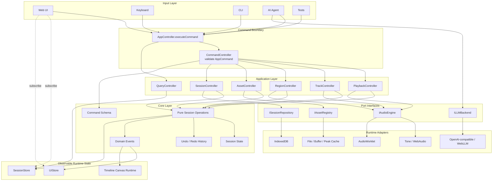
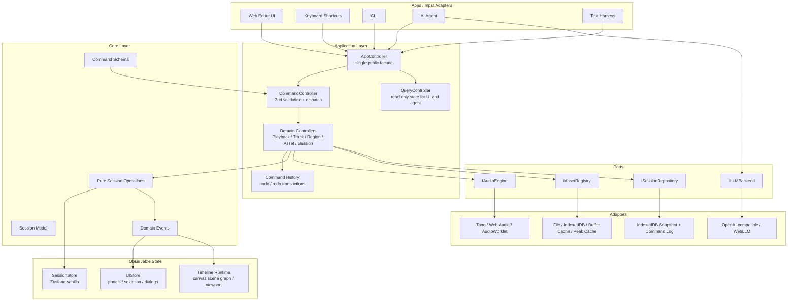
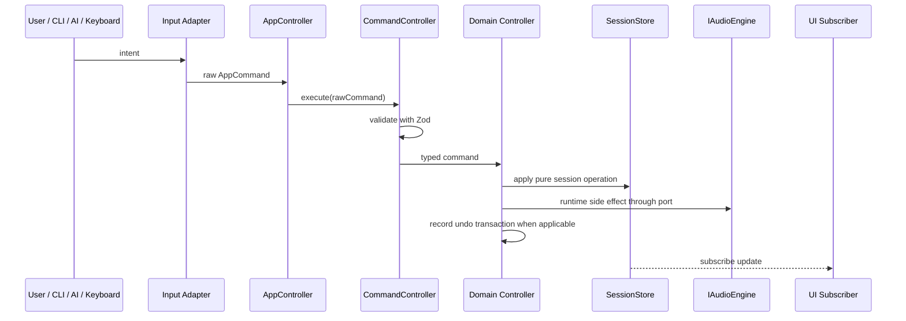
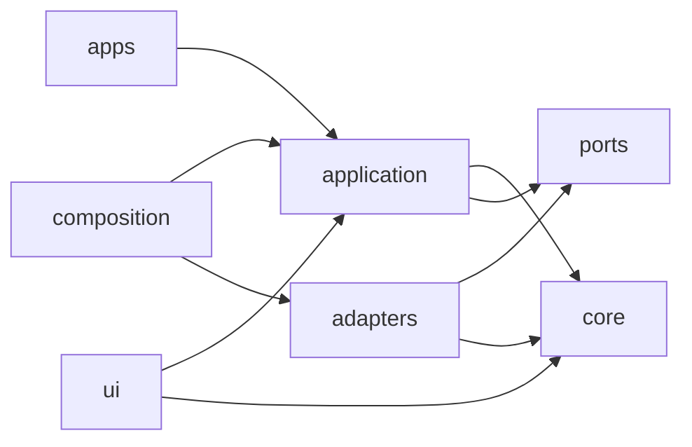
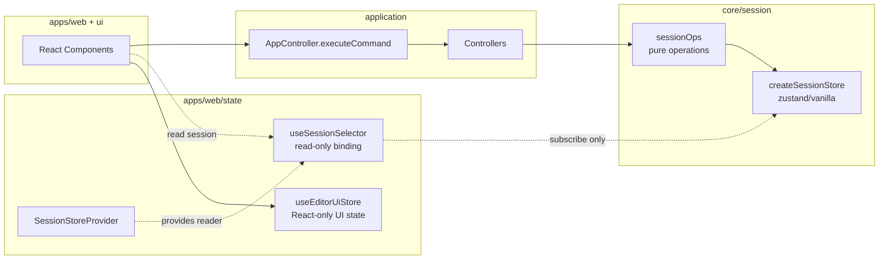
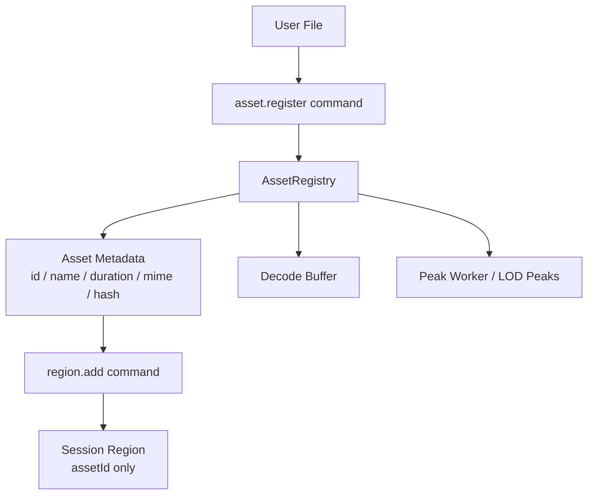
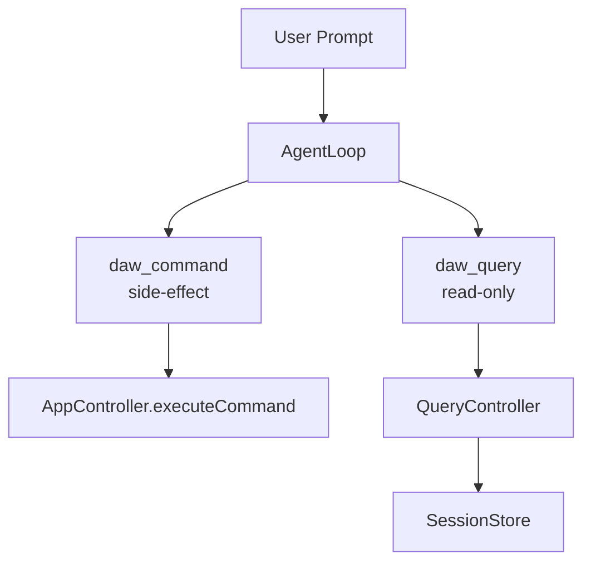

# Drop AI v3 Final Design and Rebuild Plan

## 결정 요약

`drop-ai-v3`는 현재 v3의 command-first 구조를 유지한다.

이번 리빌드의 목표는 원본 `drop.ai`를 그대로 포팅하는 것이 아니라, v3에서 이미 검증 중인 단일 command 실행 경로를 중심으로 DAW, CLI, Keyboard, AI Agent, 테스트 입력을 모두 같은 구조 위에 올리는 것이다.

모노레포는 지금 당장 도입하지 않는다. 먼저 단일 패키지 안에서 폴더를 아키텍처 경계대로 나누고, import boundary test로 의존 방향을 강제한다. 나중에 독립 빌드, 독립 배포, 패키지 공개, 앱 다중화가 실제로 필요해지면 같은 폴더 경계를 `packages/*`로 승격한다.

## 유지할 v3 핵심 구조

- 모든 쓰기 입력은 `AppController.executeCommand(rawCommand)`를 통과한다.
- `CommandController`가 Zod schema로 command를 먼저 검증한다.
- 잘못된 command는 domain controller에 도달하지 않는다.
- session write는 controller만 수행한다.
- app adapter는 command를 만들 수만 있고 session/audio/storage를 직접 수정하지 않는다.
- Tone.js, Web Audio, IndexedDB, LLM SDK는 adapter 안에만 둔다.
- 테스트는 fake adapter와 pure session operation을 우선 사용한다.

## 목표 아키텍처 한눈에 보기



이 다이어그램의 핵심은 입력과 런타임 구현체가 서로 직접 만나지 않는다는 점이다. 모든 쓰기 입력은 command boundary를 통과하고, application layer는 port interface만 호출한다. 실제 Tone, IndexedDB, LLM SDK 같은 구현체는 composition에서 adapter로 주입한다.

## 최종 아키텍처



## Command 실행 흐름



## Folder-first 구조

초기에는 단일 package를 유지한다.

```txt
src/
  core/
    commands/
      command.schema.ts
      command-types.ts
    session/
      session-state.ts
      session-store.ts
      session-operations.ts
      session-errors.ts
    history/
      command-history.ts
      undo-transaction.ts
    events/
      domain-event.ts
      event-bus.ts

  application/
    app-controller.ts
    command-controller.ts
    query-controller.ts
    controllers/
      playback-controller.ts
      track-controller.ts
      region-controller.ts
      asset-controller.ts
      session-persistence-controller.ts
      session-export-controller.ts

  ports/
    audio-engine.ts
    asset-registry.ts
    session-repository.ts
    llm-backend.ts

  adapters/
    audio/
      fake/
      tone/
      worklet/
    assets/
      memory/
      indexeddb/
    storage/
      memory/
      indexeddb/
    llm/
      openai-compatible/
      webllm/

  apps/
    cli/
    web/
      state/
        session-store-context.tsx
        use-session-selector.ts
        ui-store.ts
    keyboard/
    agent/

  composition/
    create-app.ts
    create-web-app.ts
    create-test-app.ts

  ui/
    editor/
    timeline/
    transport/
    mixer/
    shared/

  testing/
    architecture-boundary.test.ts
    fake-fixtures.ts
```

현재 `src/layers/*`는 한 번에 모두 옮기지 않는다. 다음 구현 phase에서 테스트를 유지한 채 점진적으로 위 구조로 이동한다.

## 의존 규칙



허용 규칙:

- `apps/*`는 `application`만 호출한다.
- `ui/*`는 read/query와 `executeCommand`만 사용한다.
- `application/*`은 `core`와 `ports`를 알 수 있다.
- `application/*`은 `adapters/*`를 import하지 않는다.
- `core/*`는 React, DOM, Tone, IndexedDB, LLM SDK를 모른다.
- `ports/*`는 interface만 둔다.
- `adapters/*`는 외부 런타임 라이브러리를 감싼다.
- `composition/*`만 concrete adapter를 생성하고 주입한다.

금지 규칙:

- UI에서 `sessionStore.applyOperation` 직접 호출 금지
- UI에서 `trackController.addTrack()` 같은 domain controller 직접 호출 금지
- app adapter에서 audio/storage/asset adapter 직접 호출 금지
- core에서 browser API 직접 참조 금지
- Tone.js import는 `adapters/audio/tone` 밖에서 금지
- IndexedDB 접근은 `adapters/storage/indexeddb` 또는 `adapters/assets/indexeddb` 밖에서 금지

## Zustand Store 분리 설계

Zustand는 두 종류로만 사용한다.

1. Domain/session 상태는 `zustand/vanilla` store만 사용한다.
2. React 화면 상태는 React 전용 store/hook 레이어에서만 사용한다.

React는 domain store를 새로 만들지 않는다. React는 vanilla session store를 읽기 전용으로 구독하고, session 변경은 항상 command를 실행해서 application/controller가 수행한다.



### Vanilla store: domain source of truth

위치:

```txt
src/core/session/session-store.ts
```

역할:

- `SessionState`의 유일한 source of truth
- controller/application에서만 write 가능
- React, DOM, browser API를 전혀 모름
- CLI, AI Agent, test harness에서도 그대로 사용 가능

예상 형태:

```ts
import { createStore, type StoreApi } from 'zustand/vanilla';
import type { SessionState } from './session-state';

export type SessionListener = (
  state: SessionState,
  previousState: SessionState
) => void;

export interface ISessionReader {
  getState(): SessionState;
  getInitialState(): SessionState;
  subscribe(listener: SessionListener): () => void;
}

export interface ISessionStore extends ISessionReader {
  applyOperation(transform: (state: SessionState) => SessionState): void;
}

export function createSessionStore(initialSession: SessionState): ISessionStore {
  const store: StoreApi<SessionState> = createStore<SessionState>(
    () => initialSession
  );

  return {
    getState: () => store.getState(),
    getInitialState: () => store.getInitialState(),
    subscribe: (listener) => store.subscribe(listener),
    applyOperation: (transform) => {
      store.setState((state) => transform(state), true);
    },
  };
}
```

규칙:

- `ISessionStore`는 `application/controllers/*`에만 주입한다.
- React에는 `ISessionStore` 전체가 아니라 `ISessionReader`만 넘긴다.
- `applyOperation`은 UI, CLI, Agent에 노출하지 않는다.

### React session binding: read-only 구독

위치:

```txt
src/apps/web/state/session-store-context.tsx
src/apps/web/state/use-session-selector.ts
```

역할:

- React component가 session을 selector로 읽게 해준다.
- domain session을 복제하지 않는다.
- session write API를 노출하지 않는다.

예상 형태:

```tsx
import { createContext, useContext, type ReactNode } from 'react';
import { useStore } from 'zustand';
import type { ISessionReader } from '@/core/session/session-store';
import type { SessionState } from '@/core/session/session-state';

const SessionReaderContext = createContext<ISessionReader | null>(null);

export function SessionStoreProvider({
  reader,
  children,
}: {
  reader: ISessionReader;
  children: ReactNode;
}) {
  return (
    <SessionReaderContext.Provider value={reader}>
      {children}
    </SessionReaderContext.Provider>
  );
}

export function useSessionSelector<T>(
  selector: (state: SessionState) => T
): T {
  const reader = useContext(SessionReaderContext);
  if (!reader) {
    throw new Error('SessionStoreProvider is missing.');
  }

  return useStore(reader, selector);
}
```

React component 사용 예:

```tsx
import { useSessionSelector } from '@/apps/web/state/use-session-selector';
import { useAppController } from '@/apps/web/state/app-controller-context';

export function AddTrackButton() {
  const trackCount = useSessionSelector((state) => state.trackOrder.length);
  const appController = useAppController();

  return (
    <button
      type="button"
      onClick={() => appController.executeCommand({ type: 'track.add' })}
    >
      Add track ({trackCount})
    </button>
  );
}
```

금지:

```tsx
// 금지: React에서 domain store를 직접 write
sessionStore.applyOperation(...);

// 금지: React에서 domain controller 직접 호출
trackController.addTrack();

// 금지: React 전용 store에 session state 복제
useEditorUiStore.setState({ tracksById: session.tracksById });
```

### React UI store: 화면 상태만 관리

위치:

```txt
src/apps/web/state/ui-store.ts
```

역할:

- selection
- hover
- active tool
- panel visibility
- dialogs
- inspector tab
- timeline viewport UI setting

여기에는 DAW session의 source of truth를 넣지 않는다. `track`, `region`, `asset`, `playback`의 실제 상태는 session store에만 둔다.

예상 형태:

```ts
import { create } from 'zustand';

interface EditorUiState {
  selectedTrackId: string | null;
  selectedRegionIds: string[];
  activeTool: 'select' | 'split' | 'hand';
  rightPanel: 'inspector' | 'ai' | null;
  setSelectedTrackId(trackId: string | null): void;
  setSelectedRegionIds(regionIds: string[]): void;
  setActiveTool(tool: EditorUiState['activeTool']): void;
  setRightPanel(panel: EditorUiState['rightPanel']): void;
}

export const useEditorUiStore = create<EditorUiState>((set) => ({
  selectedTrackId: null,
  selectedRegionIds: [],
  activeTool: 'select',
  rightPanel: null,
  setSelectedTrackId: (selectedTrackId) => set({ selectedTrackId }),
  setSelectedRegionIds: (selectedRegionIds) => set({ selectedRegionIds }),
  setActiveTool: (activeTool) => set({ activeTool }),
  setRightPanel: (rightPanel) => set({ rightPanel }),
}));
```

허용:

```tsx
const selectedRegionIds = useEditorUiStore(
  (state) => state.selectedRegionIds
);
```

금지:

```ts
// 금지: UI store에 domain state 복제
tracksById: Record<string, TrackState>;
regionsById: Record<string, RegionState>;
playback: PlaybackState;

// 금지: UI store action에서 command 우회
addTrackDirectly(): void;
moveRegionDirectly(): void;
```

### Zustand import boundary

허용 위치:

```txt
src/core/session/session-store.ts                 -> zustand/vanilla
src/apps/web/state/use-session-selector.ts        -> zustand React binding
src/apps/web/state/ui-store.ts                    -> zustand React store
```

금지 위치:

```txt
src/core/**            -> zustand React binding 금지
src/application/**     -> zustand React binding 금지
src/ports/**           -> zustand 전체 금지
src/adapters/**        -> zustand 전체 금지
src/apps/cli/**        -> zustand React binding 금지
src/apps/agent/**      -> zustand React binding 금지
```

추가할 boundary test:

- `react` import는 `src/apps/web/**`와 `src/ui/**`에서만 허용한다.
- `zustand/vanilla` import는 `src/core/session/session-store.ts`에서만 허용한다.
- `zustand` 또는 `zustand/react` import는 `src/apps/web/state/**`에서만 허용한다.
- `application/**`은 `ISessionStore` interface만 import하고 React hook을 import하지 않는다.
- `apps/web/**`은 `ISessionReader`만 받아야 하고 `ISessionStore.applyOperation`을 사용할 수 없다.

## 데이터 모델

Session은 직렬화와 diff에 유리한 normalized object map + order array를 유지한다.

```ts
interface SessionState {
  id: string;
  trackOrder: string[];
  tracksById: Record<string, TrackState>;
  playback: PlaybackState;
}

interface TrackState {
  id: string;
  name: string;
  volume: number;
  muted: boolean;
  soloed: boolean;
  pan: number;
  regionOrder: string[];
  regionsById: Record<string, RegionState>;
}

interface RegionState {
  id: string;
  assetId: string;
  startTime: number;
  duration: number;
  offset: number;
}
```

Region은 File, Blob, AudioBuffer를 직접 가지지 않는다. 오디오 파일과 decoded buffer는 asset layer가 관리하고, session에는 `assetId`만 저장한다.

## Asset 설계



초기 MVP에서는 memory asset registry로 시작한다. IndexedDB 저장, File System Access API, peak cache는 이후 phase에서 붙인다.

## Audio 설계

`IAudioEngine`은 application이 사용하는 유일한 오디오 port다.

초기 구현:

- `FakeAudioEngine`: unit/integration test용
- `ToneAudioEngine`: 실제 playback용
- `WorkletTrackProcessor`: 최소 track processing 경로부터 연결

원칙:

- controller는 Tone을 모른다.
- session state가 먼저 갱신되고 audio side effect가 같은 command 안에서 수행된다.
- side effect 실패 시 command result로 실패를 반환한다.
- undo/redo는 session과 audio engine을 함께 되돌릴 수 있어야 한다.

## AI Agent 설계

AI Agent는 별도 실행 권한을 갖지 않는다.



Agent MVP:

- `daw_query`: tracks, regions, playback, selection 조회
- `daw_command`: Zod command schema에 맞는 command만 실행
- dry-run 또는 confirm mode는 command result wrapper로 처리

## Web UI 설계

Web UI는 DAW 작업 화면이 첫 화면이다. landing page를 만들지 않는다.

MVP 화면:

- top transport bar
- left track list
- center timeline canvas
- right optional inspector / AI panel
- bottom status/command area

UI 원칙:

- UI event handler는 command object를 만든 뒤 `executeCommand`만 호출한다.
- timeline rendering은 React DOM 리스트가 아니라 canvas scene graph 중심으로 간다.
- selection, hover, panel open state는 `uiStore`에 둔다.
- track/region/playback의 source of truth는 `sessionStore`다.

## Phase Plan

### Phase 0. 기준선 고정

목표: 현재 v3가 안정된 출발점임을 고정한다.

작업:

- `pnpm test`, `pnpm typecheck`, `pnpm lint` 기준선 확인
- 현재 architecture boundary test 유지
- 이 문서를 canonical rebuild plan으로 둔다

완료 기준:

- unit test 통과
- typecheck 통과
- git working tree가 의도한 문서 변경만 포함

### Phase 1. Folder-first 재배치

목표: 모노레포 없이 폴더 경계를 최종 설계에 맞춘다.

작업:

- `src/layers/session` -> `src/core/session`
- command schema 일부 -> `src/core/commands`
- `src/layers/controllers` -> `src/application`
- `src/layers/audio-engine/audio-engine.ts` -> `src/ports/audio-engine.ts`
- fake/tone 구현 -> `src/adapters/audio/*`
- `src/layers/composition` -> `src/composition`
- import path와 boundary test 갱신

완료 기준:

- 기존 173개 테스트가 모두 통과
- import boundary test가 새 구조를 강제
- behavior change 없음

### Phase 2. AppController surface 축소

목표: 우회 경로를 제거한다.

작업:

- `AppController` public API를 `executeCommand`, `query`, `subscribe` 중심으로 축소
- `appController.playback`, `appController.track` 직접 노출 제거
- CLI/test/web 모두 `executeCommand` 경로만 사용하게 수정

완료 기준:

- app adapter가 domain controller를 직접 호출하지 않음
- command validation 실패 시 side effect 없음

### Phase 3. Command History / Undo / Redo

목표: undoable mutation의 단일 경로를 만든다.

작업:

- `CommandHistory`
- `UndoTransaction`
- `command.undo`
- `command.redo`
- `CompositeCommand`
- track add/remove, region add/move/remove부터 undo 적용

완료 기준:

- region move undo/redo 통과
- track add/remove undo/redo 통과
- audio fake recorder로 side effect 복원 검증

### Phase 4. Asset Registry

목표: file/audio buffer와 session region을 분리한다.

작업:

- `IAssetRegistry` port
- memory asset adapter
- `asset.register` command
- `region.add`는 `assetId`만 받도록 유지
- file import path는 `asset.register` -> `region.add` 두 command로 구성

완료 기준:

- 같은 asset으로 여러 region 생성 가능
- session serialize 시 file/blob/audio buffer가 들어가지 않음
- fake asset registry로 unit test 가능

### Phase 5. Persistence / Autosave

목표: reload recovery 가능한 session 저장을 만든다.

작업:

- `ISessionRepository`
- memory repository
- IndexedDB repository
- snapshot save/restore
- command log 저장
- dirty tracking / autosave controller

완료 기준:

- save -> restore 후 session state 동일
- reload recovery integration test 통과
- storage adapter 밖에서 IndexedDB 접근 없음

### Phase 6. Web Editor MVP

목표: 실제 사용 가능한 최소 DAW 화면을 만든다.

MVP flow:

```txt
create track
-> register audio asset
-> add region
-> show waveform block
-> play / stop
-> drag region
-> undo / redo
```

완료 기준:

- Playwright로 import/play/drag/undo 시나리오 통과
- UI에서 store write 직접 호출 없음
- timeline text/control overlap 없음

### Phase 7. Timeline Performance

목표: 원본 `drop.ai`의 성능 자산을 선별 이식한다.

작업:

- canvas scene graph
- viewport culling
- peak worker
- multi-level LOD peaks
- playhead rendering 분리

완료 기준:

- 수백 개 region mock에서도 timeline interaction이 끊기지 않음
- waveform 계산이 UI thread를 막지 않음

### Phase 8. AI Agent MVP

목표: AI가 같은 command 경로로 DAW를 조작한다.

작업:

- `daw_query`
- `daw_command`
- rule-based parser first
- LLM backend adapter
- command confirmation mode

완료 기준:

- "트랙 하나 추가해줘"가 `track.add` command로 실행됨
- "첫 번째 리전을 2초로 옮겨줘"가 `region.move` command로 실행됨
- agent가 session/audio를 직접 수정하지 않음

### Phase 9. Product Expansion

Phase 0-8이 안정된 뒤에만 진행한다.

후순위 기능:

- trim
- split 고도화
- fade/crossfade
- mixer/send/bus
- export 고도화
- MIDI/piano roll
- automation lane
- plugin chain

## 원본 drop.ai 활용 기준

가져온다:

- 테스트 아이디어
- waveform/viewport/canvas 알고리즘
- AudioWorklet build pipeline 아이디어
- AgentLoop와 command/query tool 분리
- Tone adapter 구현 세부

그대로 복사하지 않는다:

- 큰 React component 구조
- 단일 mega Zustand store
- UI에서 domain state를 직접 수정하는 흐름
- Next.js page 중심 구조
- 고급 DAW 기능을 MVP 전에 한꺼번에 가져오는 방식

## 완료 판정

1차 리빌드는 아래가 동시에 만족되면 완료로 본다.

- Web, CLI, Keyboard, AI, Test가 모두 `executeCommand`를 사용한다.
- command schema validation이 모든 side effect보다 먼저 실행된다.
- session write는 application/controller 경로에서만 발생한다.
- core는 React, DOM, Tone, IndexedDB, LLM SDK를 import하지 않는다.
- fake adapter만으로 core/application test가 통과한다.
- Web UI에서 import -> region -> play -> move -> undo/redo가 동작한다.
- AI Agent가 `daw_query`와 `daw_command`만으로 최소 편집을 수행한다.
- persistence restore test가 통과한다.

## 나중에 모노레포로 승격하는 기준

다음 조건 중 둘 이상이 실제 문제가 되면 모노레포로 전환한다.

- web과 cli를 독립적으로 빌드/배포해야 한다.
- core test가 UI/runtime dependency 때문에 느려진다.
- agent를 별도 패키지로 재사용해야 한다.
- timeline renderer를 독립 library처럼 관리해야 한다.
- package export boundary가 필요해진다.
- Changesets 기반 versioning이 필요해진다.

승격 매핑:

```txt
src/core        -> packages/core
src/application -> packages/application
src/ports       -> packages/ports
src/adapters    -> packages/adapters/*
src/ui          -> packages/ui-timeline 또는 apps/web/src/ui
src/apps/web    -> apps/web
src/apps/cli    -> apps/cli
```

그 전까지는 단일 package + folder boundary + architecture tests가 최적이다.
