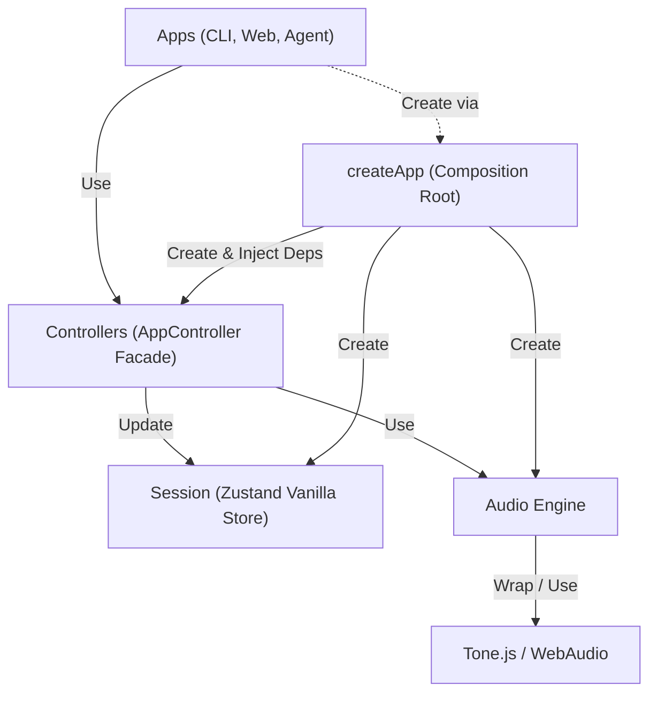

# 규칙

1. audio-engine은 controllers에서만 접근 가능하다
2. session(Zustand Vanilla Store)은 controllers에서만 접근 가능하다
3. session(Zustand React Hook)은 apps에서 접근 가능하지만, 읽기만 가능하다. 쓰기는 controller에서만 접근가능하다
4. apps는 controllers만 사용한다. 단, 최초 controllers 객체 생성시에만 session을 주입받는다.
5. tone.js(혹은 그와 유사한 라이브러리)는 audio-engine에서만 접근 가능하다
6. UI에서 접근하려면 sessionStore에 업데이트 되어야한다. audio-engine만으로는 UI를 state로 바꿀 수 없다.

## Architecture (Layers)

> **Note:** `records/` 디렉터리의 문서들은 마이그레이션 이전 구현 기록이다. 현재 아키텍처 가이드로 참고하지 않는다.
