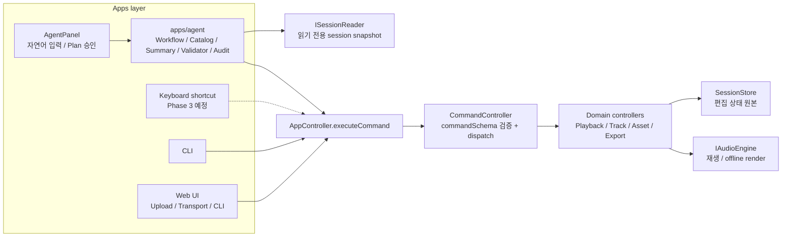
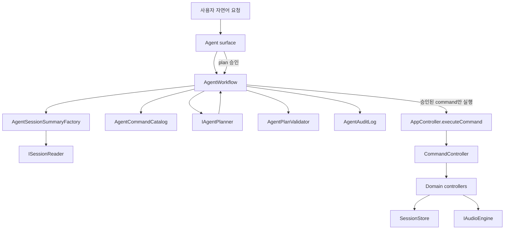

# Phase 1 Agent 아키텍처 설계

## 목표

Phase 1의 목표는 사용자의 자연어 요청을 검증 가능한 command plan으로 바꾸고, 사용자가 승인한 command만 현재
session에 적용하는 MVP workflow를 만드는 것이다.

이 문서에서 **agent**는 별도 편집 상태를 소유하는 프로세스가 아니다. `AppController.executeCommand()`와 읽기
전용 session summary를 사용하는 **자연어 기반 입력 surface**를 뜻한다.

## 현재 근거

### 사실

- Phase 1의 MVP 완료 기준은 "현재 session을 이해하고, command plan을 승인한 뒤, 승인된 command로 오디오
  편집과 WAV export를 수행할 수 있는 상태"다.
- 모든 쓰기 입력은 `AppController.executeCommand(rawCommand)`를 통과해야 한다.
- `CommandController`는 `commandSchema`로 payload를 검증한 뒤 domain controller로 dispatch한다.
- 현재 CLI registry는 문자열 입력을 `AppCommand`로 parse하는 구조다.
- 현재 `asset.register` command의 payload는 브라우저 런타임의 `File` 객체를 포함한다.
- 현재 웹 workspace에는 upload, transport, session summary, CLI terminal이 있고 waveform timeline UI는 없다.

### 추론

- Phase 1의 핵심 작업은 새 audio domain 로직이 아니다. agent 입력 surface, command catalog, session read
  model, command plan lifecycle을 추가하는 작업이다.
- CLI registry는 사람이 입력하는 문자열 parser에 가깝다. agent가 사용하려면 parser 함수가 아니라
  JSON-compatible command metadata와 payload constraints가 필요하다.
- `asset.register`는 `File` 객체가 필요하므로 LLM provider가 직접 생성할 수 없다. Phase 1에서는 기존 upload
  flow를 먼저 사용하거나, agent surface가 file picker로 받은 `File`을 opaque attachment로 command payload에
  바인딩해야 한다.

### 가정

- Phase 1은 waveform 편집 UI를 만들지 않는다. 자연어 입력, plan preview, approval UI는 agent workflow에
  필요한 최소 surface로 본다.
- 외부 LLM provider는 adapter 뒤에 둔다. provider 선택은 agent workflow core의 타입과 테스트를 막지 않는다.
- Phase 1 audit log는 undo/redo용 command history가 아니다. 승인과 실행 결과를 추적하는 in-memory
  workflow log로 시작한다.

## 용어 정의

- **AppCommand**: `commandSchema`가 검증하는 discriminated union command payload.
- **Command catalog**: agent가 사용할 수 있는 command type, 설명, payload 제약, 예시를 담은 구조화 metadata.
- **Command plan**: 실행 전 command 후보 목록과 각 command의 사용자 가시적 의도를 담은 초안.
- **Plan preview**: command plan을 실행하지 않고 사용자에게 보여주는 상태. 오디오 preview command와 다른
  개념이다.
- **Approval**: 특정 plan revision을 실행해도 된다는 사용자의 명시적 동작.
- **Queued sequential execution**: 승인된 command를 배열 순서대로 하나씩 실행하는 방식. 데이터
  직렬화(serialization)와 다른 의미다.
- **Audit log**: 요청, plan 생성, 승인, 실행 결과, 실패 정보를 append-only entry로 남기는 workflow 기록.

## 목표 아키텍처

Phase 1 agent는 전체 아키텍처에서 **Apps layer 내부에 추가되는 입력 경로**다. 새 domain layer가 아니며,
`SessionStore`나 `IAudioEngine`에 직접 접근하지 않는다. 쓰기 경로는 기존 Web UI, CLI와 동일하게
`AppController.executeCommand()`로 합류한다.



핵심 연결 방식:

- `AgentPanel`은 화면 surface다. 자연어 입력, plan preview, approve/reject UI만 담당한다.
- `apps/agent`는 agent workflow core다. session summary 생성, planner 호출, plan validation, audit log 기록,
  승인된 command 실행 순서를 담당한다.
- `IAgentPlanner`는 command 후보를 생성하지만 command를 실행하지 않는다.
- `AgentWorkflow`는 session을 읽을 때 `ISessionReader`만 사용한다.
- `AgentWorkflow`는 session을 바꿀 때 `AppController.executeCommand()`만 사용한다.
- `AgentAuditLog`는 workflow 기록이다. Phase 4의 undo/redo용 command history와 같은 저장소로 취급하지 않는다.

```txt
Apps
  Web Agent Panel / Agent CLI / Tests
    -> AgentWorkflow
      -> AgentCommandCatalog
      -> AgentSessionSummaryFactory
      -> IAgentPlanner
      -> AgentPlanValidator
      -> AgentAuditLog
      -> AppController.executeCommand(rawCommand)
        -> CommandController
          -> domain controllers
            -> SessionStore + IAudioEngine
```



## 레이어 규칙

- `apps/agent`는 `controllers` type과 `AppController`에 의존할 수 있다.
- `apps/agent`는 session state를 읽기 전용 interface로만 읽어야 한다.
- `apps/agent`는 writable session store, session operations, Tone.js, `IAudioEngine`을 import하지 않는다.
- `IAgentPlanner`는 command 후보를 반환해야 한다. command를 직접 실행하면 안 된다.
- 제안된 모든 command는 preview에 표시되기 전에 `commandSchema.safeParse()`를 통과해야 한다.
- 승인된 모든 command는 다시 `AppController.executeCommand()`를 통과해야 한다. plan validation은 controller
  boundary를 대체하지 않는다.

## 제안 모듈 구조

```txt
src/apps/agent/
  agent-command-catalog.ts
  agent-command-catalog.test.ts
  agent-session-summary.ts
  agent-session-summary.test.ts
  agent-plan.ts
  agent-plan-validator.ts
  agent-plan-validator.test.ts
  agent-audit-log.ts
  agent-audit-log.test.ts
  agent-workflow.ts
  agent-workflow.test.ts
  scripted-agent-planner.ts
  planner-adapters/
    llm-agent-planner.ts

src/apps/web/agent/
  AgentPanel.tsx
  AgentPanel.test.tsx
```

`scripted-agent-planner`는 테스트와 로컬 개발을 위한 deterministic planner다. production LLM 구현이 아니다.

## 핵심 타입 초안

```ts
export interface AgentCommandDefinition {
  type: AppCommand['type'];
  title: string;
  description: string;
  payloadDescription: string;
  examples: AppCommand[];
  availability: 'agent' | 'requiresUserAttachment' | 'disabled';
}

export interface AgentSessionSummary {
  sessionId: string;
  tracks: AgentTrackSummary[];
  playback: {
    playing: boolean;
    positionSeconds: number;
    bpm: number;
  };
  exportRange: {
    startSeconds: number;
    endSeconds: number;
    fadeInSeconds: number;
    fadeOutSeconds: number;
  };
}

export interface AgentCommandPlanStep {
  id: string;
  command: AppCommand;
  reason: string;
}

export interface AgentCommandPlan {
  id: string;
  revision: number;
  requestText: string;
  sessionSummaryFingerprint: string;
  steps: AgentCommandPlanStep[];
  status:
    | 'draft'
    | 'approved'
    | 'executing'
    | 'completed'
    | 'failed'
    | 'rejected';
}

export interface IAgentPlanner {
  createPlan(input: AgentPlanningInput): Promise<AgentPlanDraft>;
}
```

구현 중 field name은 바뀔 수 있다. 핵심 계약은 preview와 approval 전에 plan step이 검증된 `AppCommand`를
포함해야 한다는 점이다.

## Command Catalog 설계

CLI parser registry를 그대로 재사용하지 말고 agent 전용 catalog를 만든다.

- CLI registry 책임: 사용자가 입력한 문자열을 `AppCommand`로 parse한다.
- Agent catalog 책임: planner가 사용할 수 있는 `AppCommand` type과 payload constraints를 설명한다.
- 공통 불변식: 둘 다 최종적으로 같은 `commandSchema`와 `AppController.executeCommand()` boundary를 대상으로
  해야 한다.

초기 catalog grouping:

- Playback: play, pause, stop, seek, loop, bpm, master volume.
- Track: add, remove, volume, mute, solo, pan.
- Region: 기존 asset을 사용하는 region add, move, split, resize, remove.
- Export range: start 설정, end 설정, fade in 설정, fade out 설정, preview, export.
- Session export: 전체 session export.
- Asset registration: surface가 선택된 `File`을 바인딩할 수 있기 전까지 `requiresUserAttachment`로 표시한다.

## Session Summary 설계

Session summary는 JSON-compatible하고 provider-safe해야 한다.

포함할 정보:

- session id.
- track id, name, order, volume, mute, solo, pan.
- region id, asset id, start time, duration, offset.
- planning에 필요한 playback state.
- export range state.

제외할 정보:

- `File`, `Blob`, object URL, Tone.js object, WebAudio node.
- raw audio binary data.
- session state에 없는 UI-only state.

## Planning Flow

1. 사용자가 자연어 요청을 제출한다.
2. `AgentWorkflow`가 현재 session summary를 읽는다.
3. `AgentWorkflow`가 agent command catalog를 읽는다.
4. `IAgentPlanner`가 신뢰되지 않은 plan draft를 반환한다.
5. `AgentPlanValidator`가 모든 command를 `commandSchema.safeParse()`로 검증한다.
6. invalid command가 있으면 사용자에게 보여줄 validation message와 함께 draft 생성에 실패한다.
7. valid command만 draft `AgentCommandPlan`이 된다.
8. surface가 plan preview를 렌더링한다.
9. 사용자가 plan을 approve 또는 reject한다.
10. approved plan은 queued sequential execution 방식으로 `AppController.executeCommand()`를 통해 실행된다.
11. command 하나가 실패하면 이후 command는 실행하지 않는다.
12. `AgentAuditLog`가 proposal, approval, 각 command result, 최종 status를 기록한다.

## 실행 규칙

- Draft plan은 session state를 변경하면 안 된다.
- Rejected plan은 절대 실행하면 안 된다.
- Approval은 `planId`와 `revision`을 포함해야 한다.
- Plan 생성 이후 session summary fingerprint가 바뀌었으면 stale plan error로 실행을 막아야 한다.
- Command는 배열 순서대로 실행한다.
- 앞 command가 실패하면 뒤 command는 실행하지 않는다.
- Export command result는 `Blob`을 포함할 수 있다. audit entry에는 `Blob` 자체가 아니라 filename과 size를
  저장한다.

## MVP 사용자 흐름

초기 MVP는 현재 upload-first flow가 하나의 asset-backed region을 이미 만든 상태를 전제로 한다.

예시:

1. 사용자가 `voice.wav`를 업로드한다.
2. 사용자가 "1초부터 3초까지만 들려줘."라고 요청한다.
3. Agent가 다음 command를 제안한다.
   - `session.exportRange.start.set`, `seconds=1`.
   - `session.exportRange.end.set`, `seconds=3`.
   - `session.exportRange.preview.play`.
4. 사용자가 승인한다.
5. 사용자가 설정된 구간을 듣는다.
6. 사용자가 "이 구간을 WAV로 내보내줘."라고 요청한다.
7. Agent가 `session.exportRange.export`를 제안한다.
8. 사용자가 승인한다.
9. Browser가 기존 export download path를 통해 WAV를 다운로드한다.

이 흐름은 waveform UI를 추가하지 않고도 "구간을 지정하고, 들어보고, 구간 WAV를 받는" MVP path를 충족한다.

## AI Agent 기능 구현 Spec

### 범위

Phase 1에서 구현할 기능은 자연어 요청을 안전한 command plan으로 바꾸고, 사용자의 명시적 승인 이후에만 실행하는
workflow다.

포함 범위:

- 자연어 요청 입력.
- agent용 command catalog 제공.
- agent용 session summary 제공.
- planner 호출.
- planner output 검증.
- command plan preview.
- approve/reject.
- 승인된 command 실행.
- 실행 결과 요약.
- 실패 메시지 표시.
- structured audit log.
- export 결과 다운로드 연결.

제외 범위:

- waveform timeline UI.
- region drag selection UI.
- keyboard shortcut.
- undo/redo.
- project save/load.
- script manager.
- remote command API.
- raw audio binary를 LLM provider로 보내는 기능.

### 기능 요구사항

| ID     | 요구사항             | 상세                                                                                           | 완료 기준                                                    |
| ------ | -------------------- | ---------------------------------------------------------------------------------------------- | ------------------------------------------------------------ |
| AG-001 | Command catalog      | Agent가 사용할 수 있는 command type, 설명, payload 제약, 예시를 구조화해서 제공한다.           | enabled command 예시가 모두 `commandSchema`를 통과한다.      |
| AG-002 | Session summary      | 현재 session을 JSON-compatible read model로 변환한다.                                          | track, region, playback, export range가 포함된다.            |
| AG-003 | 자연어 요청 입력     | 사용자가 현재 session에 대한 요청을 입력할 수 있다.                                            | 빈 문자열은 planning을 시작하지 않는다.                      |
| AG-004 | Planner 호출         | `IAgentPlanner`에 request, command catalog, session summary를 전달한다.                        | planner는 command 후보를 반환하지만 실행하지 않는다.         |
| AG-005 | Plan validation      | planner output을 `commandSchema.safeParse()`로 검증한다.                                       | invalid command는 preview에 표시하지 않는다.                 |
| AG-006 | Plan preview         | 실행 전 command 목록과 각 command의 의도를 보여준다.                                           | preview 단계에서 session state가 바뀌지 않는다.              |
| AG-007 | Approval / rejection | 사용자가 plan revision을 approve 또는 reject할 수 있다.                                        | rejected plan은 실행되지 않는다.                             |
| AG-008 | Command execution    | approved plan의 command를 순서대로 `AppController.executeCommand()`로 실행한다.                | 앞 command 실패 시 뒤 command는 실행하지 않는다.             |
| AG-009 | Result summary       | 실행된 command의 성공 결과를 사용자에게 요약한다.                                              | export 결과는 filename과 size를 표시한다.                    |
| AG-010 | Failure message      | planning, validation, execution 실패를 사용자에게 표시한다.                                    | 실패 원인이 command validation인지 execution인지 구분된다.   |
| AG-011 | Structured audit log | request, plan, approval, command result, failure event를 구조화해서 기록한다.                  | `File`, `Blob`, raw provider response는 저장하지 않는다.     |
| AG-012 | Export download      | `session.export`와 `session.exportRange.export` 결과를 기존 download helper에 연결한다.        | 승인 후 browser download가 시작된다.                         |
| AG-013 | Attachment 처리      | `File`이 필요한 command는 planner가 직접 만들지 않고 surface가 선택한 attachment에 바인딩한다. | `asset.register`는 일반 JSON-only command로 노출되지 않는다. |
| AG-014 | Stale plan 보호      | plan 생성 후 session summary가 바뀌면 기존 plan 실행을 막는다.                                 | fingerprint mismatch면 stale plan error가 발생한다.          |

### 데이터 계약 Spec

`AgentPlanningInput`:

- `requestText`: 사용자의 자연어 요청.
- `sessionSummary`: 현재 session의 JSON-compatible summary.
- `commandCatalog`: planner가 사용할 수 있는 command metadata.
- `locale`: 사용자 입력 언어. 초기값은 `ko`.

`AgentPlanDraft`:

- planner가 반환하는 신뢰되지 않은 초안이다.
- command 후보는 `unknown`으로 받고 validator가 `AppCommand`로 좁힌다.
- 사용자가 볼 수 있는 `reason` 또는 `description`을 포함한다.

`AgentCommandPlan`:

- validator를 통과한 plan이다.
- `id`, `revision`, `requestText`, `sessionSummaryFingerprint`, `steps`, `status`를 포함한다.
- `status='draft'`인 동안에는 실행할 수 없다. approval 후 `status='approved'`가 되어야 실행할 수 있다.

`AgentExecutionResult`:

- `planId`.
- 실행된 command별 result summary.
- 첫 실패 command의 error code와 message.
- 최종 status: `completed` 또는 `failed`.

`AgentAuditEntry`:

- workflow event를 append-only로 기록한다.
- command payload는 JSON-compatible 값만 저장한다.
- export result는 `Blob`이 아니라 filename, size만 저장한다.

### 에러 처리 Spec

| 상황                   | 판정 기준                                  | 사용자 메시지 방향                                | 실행 영향               |
| ---------------------- | ------------------------------------------ | ------------------------------------------------- | ----------------------- |
| 빈 요청                | trim 후 문자열 길이가 0                    | "요청 내용을 입력해 주세요."                      | planning 시작 안 함     |
| planner 실패           | provider timeout, network error, 예외      | "요청을 command plan으로 바꾸지 못했습니다."      | draft 없음              |
| invalid planner output | `commandSchema.safeParse()` 실패           | "생성된 command 형식이 올바르지 않습니다."        | preview 표시 안 함      |
| stale plan             | fingerprint mismatch                       | "session이 변경되어 plan을 다시 생성해야 합니다." | execution 시작 안 함    |
| command 실행 실패      | `executeCommand()`가 `ok:false` 반환       | command error message 표시                        | 이후 command 실행 중단  |
| 빈 export range        | export controller가 empty range error 반환 | "선택한 구간에 export할 region이 없습니다."       | download 없음           |
| attachment 필요        | command가 `File`을 요구하지만 바인딩 없음  | "파일 선택이 필요한 작업입니다."                  | 해당 command 실행 안 함 |

### 보안과 Privacy Spec

- Phase 1에서는 raw audio binary를 planner provider에 보내지 않는다.
- Provider input에는 command catalog, session summary, 사용자의 request text만 포함한다.
- Provider prompt와 raw response는 기본 audit log에 저장하지 않는다.
- `File`, `Blob`, object URL은 audit log와 provider input에서 제외한다.
- Provider adapter는 command를 실행할 권한을 갖지 않는다.

### 수용 시나리오

아래 시나리오가 통과하면 Phase 1 MVP의 핵심 workflow가 동작한다고 볼 수 있다.

1. 사용자가 오디오 파일을 업로드해서 session에 하나의 asset-backed region을 만든다.
2. 사용자가 "1초부터 3초까지만 들려줘."라고 요청한다.
3. Agent가 export range start/end 설정과 preview command를 제안한다.
4. 사용자가 plan preview를 확인하고 approve한다.
5. App이 승인된 command만 실행하고, 설정된 range preview를 재생한다.
6. 사용자가 "이 구간을 WAV로 내보내줘."라고 요청한다.
7. Agent가 range export command를 제안한다.
8. 사용자가 approve한다.
9. App이 export command를 실행하고 WAV download를 시작한다.
10. Audit log에 요청, plan, approval, command result가 구조화되어 남는다.

## 웹 Surface

기존 upload flow가 workspace를 연 뒤 최소 `AgentPanel`을 추가한다.

필수 UI state:

- request text input.
- planning pending state.
- 순서가 있는 command list를 보여주는 plan preview.
- approve/reject control.
- execution pending state.
- result summary.
- failure message.
- compact audit log list.

`AgentPanel`은 `AgentWorkflow`를 호출해야 한다. domain controller를 직접 호출하면 안 된다.

## Audit Log 형태

```ts
export interface AgentAuditEntry {
  id: string;
  planId: string;
  event:
    | 'plan_requested'
    | 'plan_created'
    | 'plan_validation_failed'
    | 'plan_approved'
    | 'plan_rejected'
    | 'command_started'
    | 'command_succeeded'
    | 'command_failed'
    | 'plan_completed'
    | 'plan_failed';
  timestamp: number;
  details: unknown;
}
```

`details`는 구조화된 데이터를 우선한다.

- command type.
- file-like value를 제거한 command payload.
- result summary.
- error code와 message.

추후 별도 privacy decision이 있기 전까지 provider prompt, raw provider response, `File`, `Blob`은 audit log에
저장하지 않는다.

## LLM Adapter 경계

`IAgentPlanner`만 특정 LLM provider를 알아야 한다.

Adapter 책임:

- command catalog와 session summary를 provider input으로 변환한다.
- structured plan을 요청한다.
- 신뢰되지 않은 `unknown` command 후보를 반환한다.
- `AppController.executeCommand()`를 직접 호출하지 않는다.
- Phase 1에서는 raw audio binary data를 받지 않는다.

Workflow core는 network access 없이 `scripted-agent-planner`로 테스트할 수 있어야 한다.

## PR 계획

### PR 1. Agent catalog와 session summary

목표: agent-readable command metadata와 JSON-compatible session summary를 노출한다.

구현:

- `agent-command-catalog.ts` 추가.
- `agent-session-summary.ts` 추가.
- catalog coverage와 summary shape 테스트 추가.

검증:

- `pnpm typecheck`
- `pnpm lint`
- `pnpm test`

### PR 2. Plan validation과 audit log

목표: planner output을 preview 전에 검증하고 workflow event를 기록한다.

구현:

- `agent-plan.ts` 추가.
- `agent-plan-validator.ts` 추가.
- `agent-audit-log.ts` 추가.
- invalid command rejection, stale plan metadata, export result summarization 테스트 추가.

검증:

- `pnpm typecheck`
- `pnpm lint`
- `pnpm test`

### PR 3. Agent workflow core

목표: request, draft plan 생성, approval, rejection, queued sequential command execution을 지원한다.

구현:

- `agent-workflow.ts` 추가.
- `scripted-agent-planner.ts` 추가.
- 첫 번째 command 실패 시 이후 실행 중단.
- `FakeAudioEngine`을 사용하는 integration test 추가.

검증:

- `pnpm typecheck`
- `pnpm lint`
- `pnpm test`

### PR 4. 최소 Web AgentPanel

목표: upload 이후 browser에서 Phase 1 workflow를 노출한다.

구현:

- `src/apps/web/agent/AgentPanel.tsx` 추가.
- `WorkspaceScreen`에 렌더링.
- request input, plan preview, approve/reject control, result summary, audit entry 표시.
- export result는 기존 browser download helper 재사용.

검증:

- `pnpm typecheck`
- `pnpm lint`
- `pnpm test`
- 수동 확인: audio upload, range preview 요청, approve, range export 요청, approve, WAV 다운로드.

### PR 5. Production planner adapter

목표: workflow semantics를 바꾸지 않고 실제 planner provider를 연결한다.

구현:

- `planner-adapters/llm-agent-planner.ts` 추가.
- provider 설정은 environment variable을 통해 주입.
- 테스트에서는 계속 `scripted-agent-planner` 사용.
- provider failure를 사용자에게 보여줄 planning error로 변환.

검증:

- `pnpm typecheck`
- `pnpm lint`
- `pnpm test`
- provider 설정 후 수동 확인.

Provider가 정해지지 않으면 PR 5는 blocked 상태로 둔다. PR 1-4는 command-safe workflow를 만들지만, Phase 1의
"AI" 부분을 완료했다고 볼 수는 없다.

## 테스트 계획

- Catalog 테스트:
  - enabled agent command의 예시가 모두 valid `AppCommand`인지 확인한다.
  - `asset.register`가 일반 JSON-only command로 노출되지 않는지 확인한다.
- Summary 테스트:
  - summary가 track, region, playback, export range data를 포함하는지 확인한다.
  - summary가 file-like, blob-like runtime value를 제외하는지 확인한다.
- Validator 테스트:
  - unknown command type을 reject한다.
  - invalid payload를 reject한다.
  - validated `AppCommand` value를 보존한다.
- Workflow 테스트:
  - request는 command를 실행하지 않고 draft만 만든다.
  - reject는 execution을 막는다.
  - approve는 command를 순서대로 실행한다.
  - 첫 번째 실패 command 이후 execution을 중단한다.
  - stale session fingerprint면 execution을 막는다.
  - audit log가 proposal, approval, command result, final status를 기록한다.
- Web 테스트:
  - plan preview를 렌더링한다.
  - approve가 workflow execution을 trigger한다.
  - failure message가 화면에 보인다.
  - export result가 기존 browser download helper를 통해 download를 시작한다.

## 완료 기준

Phase 1은 아래 항목이 모두 참일 때 완료로 본다.

- Agent가 structured command catalog를 노출한다.
- Agent가 structured session summary를 읽는다.
- 사용자가 자연어 요청을 제출할 수 있다.
- Planner가 command 후보를 반환한다.
- 사용자가 command plan을 실행 전에 preview할 수 있다.
- 사용자가 plan을 approve 또는 reject할 수 있다.
- Approved command가 `AppController.executeCommand()`를 통해 실행된다.
- Command execution result가 요약된다.
- Command execution failure가 사용자에게 표시된다.
- Structured audit log가 request, plan, approval, execution, failure event를 기록한다.
- Agent surface에서 range preview와 range WAV export workflow가 동작한다.

## 열린 질문

- Agent가 file upload까지 시작해야 하는가, 아니면 Phase 1은 기존 upload-first flow 이후부터 시작해야 하는가?
- `llm-agent-planner`는 어떤 LLM provider를 사용할 것인가?
- Audit log entry는 Phase 4 project save/load에 포함할 것인가, 아니면 session-local workflow record로 둘 것인가?
- Phase 1에서 "track을 만들고, 그 새 track에 region을 추가해줘"처럼 command result를 참조하는 symbolic reference를
  지원할 것인가? 초기 MVP는 session summary에 이미 존재하는 id만 참조하게 해서 이 문제를 피할 수 있다.
