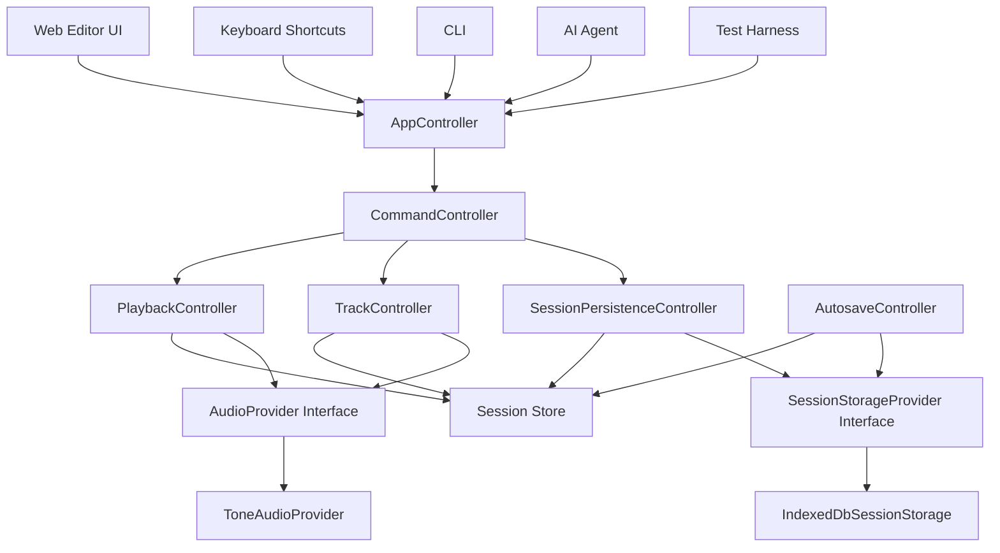

# Drop AI v3 Rebuild Execution Plan

> 문서 상태: 과거 rebuild 실행 계획.
>
> 현재 제품 목표는 command-first 구조 검증이 아니라 실제로 작동하는 browser lightweight DAW다. 최신 기준은 [README.md](../README.md), [ARCHITECTURE.md](../ARCHITECTURE.md), [docs/README.md](./README.md)를 우선한다.

## 이 문서의 목적

이 문서는 `drop-ai-v3`를 command-first 구조로 다시 세우기 위한 실제 작업 계획이다.

목표는 기능 목록을 나열하는 것이 아니라, 작업자가 어떤 순서로 생각하고, 어떤 실패 테스트를 먼저 쓰고, 어떤 기준으로 다음 단계로 넘어갈지 정하는 것이다.

이번 rebuild의 핵심은 하나다.

> UI, 키보드, CLI, AI Agent, 테스트 입력이 모두 같은 command 실행 경로를 사용한다.

입력 방식은 달라도 실행 경로는 반드시 아래처럼 고정한다.

```txt
Input Adapter
  -> AppCommand
  -> AppController.executeCommand(rawCommand)
  -> CommandController
  -> Domain Controller
  -> Session Store / AudioProvider / StorageProvider
```

## 현재 기준선

현재 v3에는 다음 골격이 있다.

- `src/layers/controllers/command.schema.ts`
  - Zod discriminated union 기반 `AppCommand` 계약
- `src/layers/controllers/command-controller.ts`
  - command validation 후 controller dispatch
- `src/layers/controllers/app-controller.ts`
  - `executeCommand` facade
- `src/layers/apps/cli/cli-parser.ts`
  - CLI 문자열을 `AppCommand`로 변환
- `docs/discipline.md`
  - layer 접근 규칙

아직 비어 있거나 만들어야 하는 영역은 다음이다.

- core session model
- 실제 playback/track/session persistence controller
- `AudioProvider` 인터페이스
- Tone.js adapter
- IndexedDB session storage
- autosave dirty tracking
- Web editor UI
- keyboard command adapter
- AI Agent command adapter
- end-to-end recovery test

## 반드시 지킬 설계 원칙

### 1. 모든 실행은 command를 통과한다

앱 입력은 command를 만들 수만 있다.

허용:

```ts
await appController.executeCommand({
  type: 'track.add',
});
```

금지:

```ts
sessionStore.getState().addTrack();
audioProvider.createTrack();
trackController.addTrack();
```

UI, keyboard, CLI, AI Agent, 테스트 harness는 모두 `AppController.executeCommand`만 호출한다.

### 2. command validation은 실행보다 앞선다

잘못된 payload는 controller method가 호출되기 전에 막혀야 한다.

예를 들어 아래 command는 `TrackController`에 도달하면 안 된다.

```ts
{
  type: 'track.volume.set',
  payload: {
    trackId: 'track-1',
    volume: 2,
  },
}
```

검증 실패는 항상 command result로 표현한다.

```ts
{
  ok: false,
  error: {
    code: 'COMMAND_VALIDATION_FAILED',
    message: 'Command payload is invalid.',
  },
}
```

### 3. core는 브라우저와 Tone.js를 모른다

core/session/controller unit test는 다음 없이 실행되어야 한다.

- DOM
- Web Audio API
- Tone.js
- IndexedDB
- 실제 파일 시스템 저장소

core가 알아야 하는 것은 순수한 상태와 interface뿐이다.

### 4. Tone.js는 adapter 안에만 둔다

Tone.js import는 오직 audio adapter에서만 허용한다.

허용 위치 예시:

```txt
src/layers/audio/tone/tone-audio-provider.ts
```

금지 위치:

```txt
src/layers/controllers/**
src/layers/core/**
src/layers/apps/**
```

controller는 `AudioProvider`만 사용한다.

### 5. IndexedDB는 storage adapter 안에만 둔다

IndexedDB 접근은 session persistence adapter에만 둔다.

허용 위치 예시:

```txt
src/layers/storage/indexeddb/indexed-db-session-storage.ts
```

controller는 `SessionStorageProvider` interface만 사용한다.

### 6. session write는 controller만 한다

apps는 session을 읽을 수는 있지만 직접 쓰면 안 된다.

UI에서 상태가 바뀌어야 할 때도 직접 store action을 호출하지 않는다.
항상 command를 실행하고, controller가 session을 바꾼다.

### 7. TDD 순서를 지킨다

각 기능은 아래 루프로 진행한다.

```txt
1. 실패 테스트를 먼저 쓴다.
2. 가장 작은 구현으로 통과시킨다.
3. 중복과 이름을 정리한다.
4. 같은 목적 단위로 커밋한다.
```

테스트 없이 구현부터 들어가지 않는다.

## Target Architecture



## Directory Plan

목표 구조는 아래처럼 잡는다.

```txt
src/layers/
  apps/
    cli/
    web/
    agent/
    keyboard/
  audio/
    audio-provider.ts
    fake-audio-provider.ts
    tone/
      tone-audio-provider.ts
  controllers/
    app-controller.ts
    command-controller.ts
    command-result.ts
    command.schema.ts
    playback-controller.ts
    track-controller.ts
    session-persistence-controller.ts
    autosave-controller.ts
  core/
    session/
      session-state.ts
      session-store.ts
      session-operations.ts
      session-errors.ts
  storage/
    session-storage-provider.ts
    memory-session-storage.ts
    indexeddb/
      indexed-db-session-storage.ts
  testing/
```

이 구조는 고정된 정답이 아니라 시작점이다.
다만 layer boundary는 유지한다.

## Milestone 0. Baseline 정리

### 작업자가 먼저 확인할 질문

- 현재 테스트를 실행할 수 있는가?
- command schema와 controller 테스트가 현재 의도를 충분히 표현하는가?
- layer 규칙을 문서가 아니라 테스트로도 막을 수 있는가?

### 할 일

1. dependency 설치
2. 기존 테스트 실행
3. typecheck 실행
4. architecture boundary test 추가

### 먼저 쓸 테스트

- `tone` import가 audio adapter 밖에 있으면 실패
- `indexedDB` 접근이 storage adapter 밖에 있으면 실패
- `apps` layer에서 session write API를 직접 import하면 실패
- `apps` layer에서 audio provider를 직접 import하면 실패

### 완료 기준

```txt
pnpm test:unit
pnpm typecheck
```

두 명령이 통과한다.

## Milestone 1. Command Contract 고정

### 작업자가 먼저 확인할 질문

- 이 command는 사용자 의도인가, 내부 구현 detail인가?
- 같은 의도를 UI/CLI/Agent가 모두 만들 수 있는가?
- 잘못된 payload가 실행 전에 막히는가?

### 할 일

1. command fixture를 만든다.
2. valid command와 invalid command를 분리한다.
3. `CommandController`가 invalid command를 dispatch하지 않는지 확인한다.
4. `CommandResult`를 모든 입력 경로가 공통으로 사용할 수 있게 유지한다.

### 먼저 쓸 테스트

```txt
command.schema.test.ts
  - accepts valid playback commands
  - rejects invalid playback payloads
  - accepts valid track commands
  - rejects invalid track payloads
  - accepts valid region commands
  - rejects invalid region payloads
  - rejects extra fields

command-controller.test.ts
  - rejects invalid commands before dispatch
  - returns validation failure result
  - wraps thrown controller errors as execution failure
```

### 구현 기준

- `z.discriminatedUnion('type', [...])`를 유지한다.
- `.strict()`를 사용해 예상하지 못한 field를 막는다.
- number range는 schema에서 먼저 막는다.
- domain 존재 여부는 schema가 아니라 controller/core에서 막는다.

### 완료 기준

- command schema가 실행 전 payload guard 역할을 한다.
- invalid command에서 target controller mock이 호출되지 않는다.

## Milestone 2. Core Session Model

### 작업자가 먼저 확인할 질문

- 이 로직은 오디오 엔진 없이 설명 가능한가?
- 이 로직은 브라우저 없이 테스트 가능한가?
- 상태 변경 결과가 session snapshot만 보고 검증 가능한가?

### 할 일

1. session state type 정의
2. track operation 정의
3. region operation 정의
4. playback operation 정의
5. dirty state 정의
6. domain error 정의

### 예상 session state

```ts
interface SessionState {
  id: string;
  tracks: TrackState[];
  playback: PlaybackState;
  dirty: boolean;
  updatedAt: string;
}
```

```ts
interface TrackState {
  id: string;
  name: string;
  volume: number;
  muted: boolean;
  soloed: boolean;
  pan: number;
  regions: RegionState[];
}
```

```ts
interface RegionState {
  id: string;
  assetId: string;
  startTime: number;
  duration: number;
}
```

### 먼저 쓸 테스트

```txt
session-operations.test.ts
  - adds a track with default mixer values
  - removes a track and its regions
  - sets track volume within command-validated range
  - adds a region to a track
  - moves a region
  - splits a region into two regions
  - rejects split outside region bounds
  - resizes a region
  - marks session dirty after mutations
```

### 구현 기준

- core operation은 입력 state를 받아 새 state를 반환하거나, store action 내부에서만 mutation한다.
- 없는 track/region은 명확한 domain error를 던진다.
- ID 생성은 주입한다.
- 테스트에서는 deterministic ID generator를 사용한다.

### 완료 기준

- core session 테스트가 DOM/Tone/IndexedDB 없이 통과한다.
- session state만 보고 편집 결과를 검증할 수 있다.

## Milestone 3. 실제 Controllers 구현

### 작업자가 먼저 확인할 질문

- controller가 command intent를 domain operation으로 정확히 번역하는가?
- session state와 audio side effect 순서가 일관적인가?
- 실패했을 때 partial update가 남는가?

### 할 일

1. `TrackController` 구현
2. `PlaybackController` 구현
3. `SessionPersistenceController` 구현
4. `CommandController` target을 실제 controller로 연결
5. composition root 설계

### 먼저 쓸 테스트

```txt
track-controller.test.ts
  - addTrack updates session store
  - removeTrack updates session store and audio provider
  - addRegionFromAsset updates session and syncs audio

playback-controller.test.ts
  - handlePlay calls audioProvider.play
  - handlePause updates playback state and pauses audio
  - handleSeek updates session and audio position

session-persistence-controller.test.ts
  - saveSession writes current session to storage
  - restoreSession replaces current session from storage
```

### 구현 기준

- controller는 class로 유지한다.
- controller는 session store와 provider interface를 의존성으로 받는다.
- controller는 UI event나 CLI string을 몰라야 한다.

### 완료 기준

아래 호출 하나로 실제 session 변화가 일어난다.

```ts
await appController.executeCommand({ type: 'track.add' });
```

## Milestone 4. AudioProvider 분리

### 작업자가 먼저 확인할 질문

- 이 테스트가 Tone.js 없이 가능한가?
- controller가 오디오 구현 detail을 알고 있지는 않은가?
- UI가 오디오 엔진을 직접 호출하고 있지는 않은가?

### 할 일

1. `AudioProvider` interface 정의
2. `FakeAudioProvider` 구현
3. controller 테스트를 fake provider로 작성
4. `ToneAudioProvider` adapter 구현
5. import boundary test 추가

### 예상 interface

```ts
export interface AudioProvider {
  play(): Promise<void>;
  pause(): void;
  stop(): void;
  seek(seconds: number): void;
  setBpm(bpm: number): void;
  setMasterVolume(volume: number): void;
  syncSession(session: SessionState): Promise<void>;
}
```

### 먼저 쓸 테스트

```txt
audio-provider-boundary.test.ts
  - controllers use AudioProvider interface only
  - tone is imported only inside audio/tone

playback-controller.test.ts
  - play delegates to AudioProvider
  - seek delegates to AudioProvider after session update
```

### 구현 기준

- Tone.js adapter는 가능한 얇게 유지한다.
- 복잡한 편집 판단은 Tone adapter에 넣지 않는다.
- Tone adapter는 session snapshot을 받아 audio graph를 맞추는 역할만 한다.

### 완료 기준

- controller/core 테스트가 Tone.js 초기화 없이 통과한다.
- `tone` import 위치가 adapter로 제한된다.

## Milestone 5. IndexedDB Storage와 Dirty Tracking

### 작업자가 먼저 확인할 질문

- 저장은 command로도 가능하고 autosave로도 가능한가?
- dirty flag가 실제 저장 성공 이후에만 false가 되는가?
- 새로고침 복구는 어떤 snapshot을 기준으로 하는가?

### 할 일

1. `SessionStorageProvider` interface 정의
2. `MemorySessionStorage` 구현
3. `IndexedDbSessionStorage` 구현
4. dirty tracking 구현
5. autosave debounce 구현
6. restore flow 구현

### 예상 interface

```ts
export interface SessionStorageProvider {
  loadLatest(): Promise<SessionState | null>;
  save(session: SessionState): Promise<void>;
  clear(): Promise<void>;
}
```

### 먼저 쓸 테스트

```txt
session-persistence-controller.test.ts
  - saveSession persists current session
  - saveSession clears dirty after successful save
  - saveSession keeps dirty when storage fails
  - restoreSession loads latest session

autosave-controller.test.ts
  - schedules save when session becomes dirty
  - debounces repeated changes
  - does not save clean session
```

### IndexedDB 테스트 전략

unit test는 `MemorySessionStorage`로 시작한다.
IndexedDB adapter는 별도 adapter test에서 검증한다.

필요하면 `fake-indexeddb`를 dev dependency로 추가한다.

### 완료 기준

- command 실행 후 dirty가 true가 된다.
- save 성공 후 dirty가 false가 된다.
- reload recovery integration test가 가능하다.

## Milestone 6. Input Adapter 통합

### 작업자가 먼저 확인할 질문

- 이 입력은 command를 만들 뿐인가?
- 이 입력이 session/audio/storage를 직접 만지지는 않는가?
- 같은 사용자 의도가 모든 입력에서 같은 command가 되는가?

### 할 일

1. CLI parser를 command adapter로 유지
2. keyboard shortcut adapter 추가
3. Web UI command adapter 추가
4. AI Agent command adapter 추가
5. test harness helper 추가
6. all-inputs integration test 작성

### 먼저 쓸 테스트

```txt
input-command-equivalence.test.ts
  - web track add creates track.add
  - keyboard track add creates track.add
  - cli "track add" creates track.add
  - agent "트랙 하나 추가해줘" creates track.add
  - test harness command creates track.add
  - all inputs execute through AppController.executeCommand
```

### 구현 기준

- adapter는 command 생성까지만 책임진다.
- adapter는 command result를 자기 환경에 맞게 표현할 수 있다.
- adapter는 domain controller를 직접 import하지 않는다.

### 완료 기준

아래 다섯 입력이 같은 session 변화를 만든다.

```txt
Web UI: Add Track button
Keyboard: configured shortcut
CLI: track add
Agent: 트랙 하나 추가해줘
Test: executeCommand({ type: 'track.add' })
```

## Milestone 7. Web Audio Editor UI

### 작업자가 먼저 확인할 질문

- 이 UI control은 어떤 command를 실행하는가?
- UI가 command result 실패를 어떻게 보여주는가?
- UI가 session을 직접 바꾸고 있지는 않은가?

### 할 일

1. app composition root 작성
2. read-only session selector 작성
3. transport UI 작성
4. track mixer UI 작성
5. timeline/region UI 작성
6. autosave 상태 UI 작성
7. restore UX 작성

### UI 범위

Transport:

- play
- pause
- stop
- seek
- loop
- bpm
- master volume

Track:

- add
- remove
- volume
- mute
- solo
- pan

Region:

- add
- move
- split
- resize
- remove

Session:

- save
- restore
- export
- autosave state

### 먼저 쓸 테스트

```txt
editor-ui.test.tsx
  - clicking add track executes track.add command
  - changing volume executes track.volume.set command
  - pressing play executes playback.play command
  - invalid command result is rendered as an error state
```

### 구현 기준

- UI component는 command 생성과 렌더링만 한다.
- session write는 controller를 통해서만 발생한다.
- audio provider는 UI에서 import하지 않는다.

### 완료 기준

- 사용자가 기본 편집을 UI에서 수행할 수 있다.
- UI의 모든 mutation은 command test로 추적 가능하다.

## Milestone 8. AI Agent Command Adapter

### 작업자가 먼저 확인할 질문

- Agent가 직접 실행할 만큼 의도가 명확한가?
- 애매한 요청은 질문으로 돌려야 하는가?
- Agent가 만든 command도 schema validation을 통과하는가?

### 할 일

1. Agent input parser 또는 tool interface 정의
2. 한국어 intent fixture 작성
3. command proposal result 정의
4. ambiguous request 처리
5. command execution 연결

### 먼저 쓸 테스트

```txt
agent-command-adapter.test.ts
  - "트랙 하나 추가해줘" proposes track.add
  - "track-1 볼륨 0.5로 줄여줘" proposes track.volume.set
  - "처음부터 재생해줘" proposes playback.seek and playback.play if supported
  - ambiguous request returns clarification instead of executing
  - invalid proposed command is blocked by command schema
```

### 구현 기준

- Agent는 command를 제안하거나 실행 요청만 한다.
- Agent는 session store, audio provider, storage provider를 모른다.
- 명확하지 않은 요청은 실행하지 않는다.

### 완료 기준

Agent 입력도 CLI/UI와 동일한 command path로 실행된다.

## Milestone 9. End-to-End Recovery

### 작업자가 먼저 확인할 질문

- 실제 사용자가 새로고침해도 편집 상태가 돌아오는가?
- autosave가 너무 자주 저장하지는 않는가?
- 저장 실패를 사용자가 알 수 있는가?

### 할 일

1. e2e 테스트 환경 구성
2. UI에서 track 추가
3. region 추가/수정
4. autosave 대기
5. page reload
6. restore 확인
7. CLI/Agent command path smoke test

### 먼저 쓸 테스트

```txt
editor-recovery.e2e.ts
  - creates an edit session
  - waits for autosave
  - reloads the page
  - restores tracks and regions from IndexedDB
```

### 완료 기준

새로고침 이후에도 session이 복구된다.

## Commit Plan

커밋은 기능이 아니라 검증 가능한 목적 단위로 나눈다.

```txt
docs(rebuild): add execution plan and rules
chore(test): install and verify baseline test environment
test(architecture): add layer boundary tests
test(commands): lock command contract fixtures
feat(commands): harden command validation and result shape
test(session): specify pure session operations
feat(session): implement session model and operations
test(controllers): specify session and audio controller behavior
feat(controllers): implement playback track and persistence controllers
test(audio): specify audio provider boundary
feat(audio): add audio provider and tone adapter
test(storage): specify dirty tracking and session persistence
feat(storage): add indexeddb storage and autosave
test(inputs): prove input command equivalence
feat(inputs): route cli keyboard ui agent through command path
test(ui): specify editor command behavior
feat(ui): build audio editor surface
test(e2e): cover indexeddb reload recovery
```

## Definition of Done

각 milestone은 다음 조건을 만족해야 끝난다.

```txt
1. 실패 테스트가 먼저 있었다.
2. 구현은 테스트를 통과하는 최소 범위다.
3. layer rule을 깨는 import가 없다.
4. command path를 우회하는 mutation이 없다.
5. unit test와 typecheck가 통과한다.
6. 변경 목적이 한 문장으로 설명된다.
```

최종 rebuild 완료 기준은 다음이다.

```txt
1. UI, keyboard, CLI, AI Agent, test harness가 모두 AppController.executeCommand를 사용한다.
2. Zod command schema가 invalid payload를 실행 전에 막는다.
3. core/controller 테스트가 Tone.js와 browser API 없이 실행된다.
4. Tone.js는 AudioProvider adapter 내부에만 있다.
5. IndexedDB session storage가 autosave와 restore를 지원한다.
6. dirty tracking이 저장 전후 상태를 정확히 표현한다.
7. 새로고침 이후 편집 session이 복구된다.
```

## 작업 중 판단 규칙

작업 중 애매한 상황이 생기면 아래 순서로 판단한다.

### 새 command를 추가해야 하는가?

추가한다:

- UI/CLI/Agent에서 같은 사용자 의도가 반복된다.
- controller method를 직접 노출하면 입력 경로가 갈라진다.
- payload validation이 필요한 사용자 행동이다.

추가하지 않는다:

- 내부 helper 호출이다.
- 특정 UI component만의 local state다.
- session read-only selector로 해결된다.

### controller에 넣을 것인가, core에 넣을 것인가?

core에 둔다:

- 순수한 session state 변환
- track/region/playback 규칙
- domain validation

controller에 둔다:

- command intent를 core operation으로 연결
- session store 업데이트
- audio provider 호출
- storage provider 호출

### adapter에 넣을 것인가?

adapter에 둔다:

- Tone.js 구체 API
- IndexedDB 구체 API
- keyboard event parsing
- CLI string parsing
- Agent natural language parsing
- browser-only API

### 테스트를 어디에 둘 것인가?

core test:

- 순수 session state 결과를 검증한다.

controller test:

- session store와 provider 호출을 검증한다.

adapter test:

- 외부 API와의 변환을 검증한다.

integration test:

- command 하나가 session/audio/storage까지 가는 흐름을 검증한다.

e2e test:

- 실제 사용자 흐름과 reload recovery를 검증한다.

## Anti-Patterns

다음 패턴은 rebuild 중 발견 즉시 고친다.

```txt
UI component imports session write action
UI component imports Tone.js
CLI calls TrackController directly
Agent calls SessionStore directly
CommandController accepts already parsed command only
Audio adapter owns domain editing rules
IndexedDB code appears in controller
Tests pass only because browser APIs are globally mocked everywhere
```

## 첫 번째 실제 작업 순서

바로 다음 작업은 아래 순서로 시작한다.

```txt
1. pnpm install
2. pnpm test:unit
3. pnpm typecheck
4. architecture boundary test 추가
5. command fixture 정리
6. core session model 실패 테스트 작성
7. session operation 최소 구현
```

이 순서가 중요한 이유는 command boundary가 흔들린 상태에서 UI나 Tone.js를 붙이면 이후 입력 경로가 다시 갈라지기 때문이다.
먼저 command와 core를 고정하고, 그다음 adapter를 붙인다.
