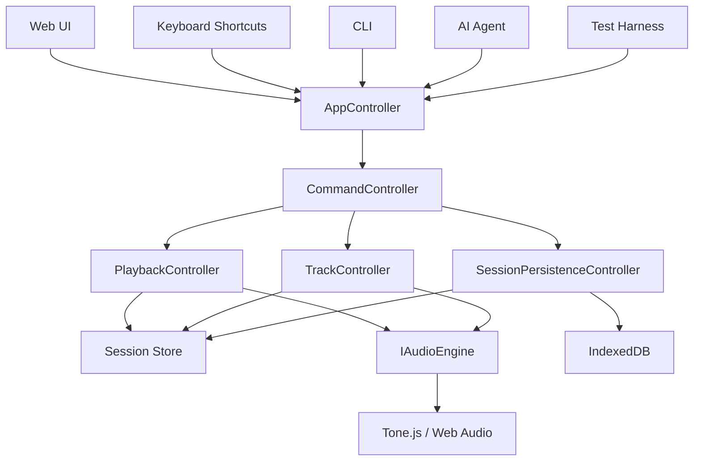

# Command-First Rebuild Plan

## Goal

This project rebuild keeps the existing layer discipline while making every
input path execute the same command flow.

The first production result must support commands from:

- Web editor UI
- Keyboard shortcuts
- CLI
- AI agent
- Test harness

All of them must call the controller layer. None of them should mutate session
state or audio state directly.

## Non-Goals

- Billing, credits, invoices, subscriptions, and usage limits are out of scope
  for this rebuild phase.
- The rebuild should not replace the controller style with plain function-only
  modules.
- The rebuild should not move Tone.js or browser APIs into UI components.

## Layer Rules

The rebuild follows these rules from the previous project:

1. Apps use controllers only.
2. Controllers are classes.
3. Controllers may access the session store and audio engine.
4. Apps must not access the session store for writes.
5. Apps must not access the audio engine directly.
6. Tone.js and Web Audio details stay inside the audio engine adapter.
7. Browser-only APIs are kept behind adapters or app-level boundaries.
8. Object creation and dependency wiring happen in the composition root.

## Target Flow



## Command Boundary

`AppController` exposes a single command entry point:

```ts
appController.executeCommand(rawCommand);
```

The `CommandController` owns validation and dispatch:

1. Validate the raw command with a Zod discriminated union.
2. Return a typed failure before side effects when validation fails.
3. Dispatch valid commands to existing class controllers.
4. Return a `CommandResult` that apps can format for UI, CLI, or agent output.

The apps can parse or propose commands, but they cannot execute business logic.

## Initial Command Set

Playback commands:

- `playback.play`
- `playback.pause`
- `playback.stop`
- `playback.seek`
- `playback.loop.set`
- `playback.bpm.set`
- `playback.masterVolume.set`

Track commands:

- `track.add`
- `track.remove`
- `track.volume.set`
- `track.mute.set`
- `track.solo.set`
- `track.pan.set`

Region commands:

- `region.add`
- `region.move`
- `region.split`
- `region.resize`
- `region.remove`

Session commands:

- `session.save`
- `session.restore`
- `session.export`

## TDD Order

Each feature follows this loop:

1. Write the failing test.
2. Implement the smallest class or method that passes it.
3. Refactor while keeping tests green.
4. Commit by one purpose.

Recommended commit sequence:

1. `docs(rebuild): define command-first layer plan`
2. `chore(test): prepare controller test fixtures`
3. `test(commands): specify command validation`
4. `feat(commands): add zod command schema`
5. `test(commands): specify CommandController dispatch`
6. `feat(commands): implement CommandController`
7. `test(app): expose unified command execution`
8. `feat(app): wire command execution into AppController`
9. `test(cli): specify CLI parser command mapping`
10. `feat(cli): route CLI input through AppController`
11. `test(agent): specify agent command proposal flow`
12. `feat(agent): route agent commands through AppController`

## First Milestone

The first milestone is complete when these three calls produce the same session
change through the same controller path:

```ts
await appController.executeCommand({ type: "track.add" });
```

```txt
track add
```

```txt
트랙 하나 추가해줘
```

The CLI and AI agent may produce different text output, but both must reach
`AppController.executeCommand` and then `CommandController`.

## Verification

For this document-only step:

- Check that the document exists under `docs/architecture`.
- Check that no source code changed.

For the next code step:

- Add tests before implementation.
- Run unit tests after each green step.
- Keep each commit focused on one purpose.
