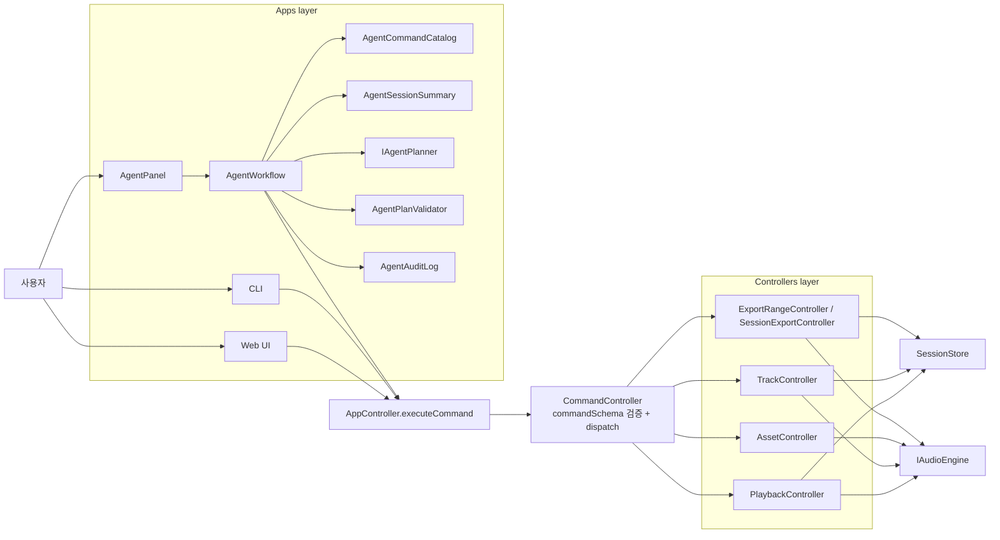
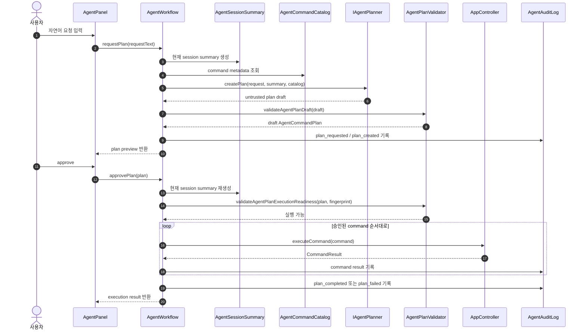
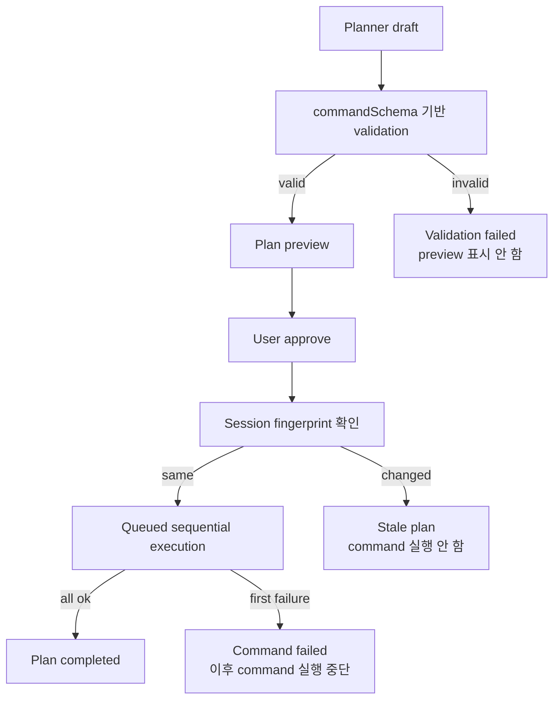

# Agent 작업 로그

## 개요

이 문서는 Phase 1 agent 기능을 구현하면서 남긴 작업 기록이다. 여기서 **agent**는 별도 상태 소유자가 아니라,
사용자 자연어 요청을 command plan으로 바꾸고 승인된 command만 기존 `AppController.executeCommand()` 경계로
전달하는 입력 surface를 뜻한다.

기록 기준:

- **작업내용**: 실제로 추가하거나 변경한 산출물.
- **문제**: 해결하려던 제품/기술 상황.
- **원인/배경**: 문제가 생긴 구조적 제약이나 구현 전제. root cause가 확인된 경우에만 원인으로 단정한다.
- **해결**: 적용한 구현 또는 문서화 방식.
- **결과**: 확인된 산출물과 검증 결과. 측정하지 않은 효과는 단정하지 않는다.
- **선택의 근거**: 다른 선택지보다 해당 접근을 고른 이유.
- **트레이드오프**: 얻은 것과 비용.
- **사고의 흐름**: 구현 순서와 판단 과정.

이 문서의 1-10장은 기존 Phase 1 agent 작업 기록을 보존한다. 해당 장의 브랜치명, PR 번호, 과거 커밋 해시는
당시 작업 순서를 설명하는 역사 기록이며, 현재 `main`에 재적용된 커밋 해시는 11장에 별도로 적는다.

## 아키텍처 다이어그램

### 전체 구조

Phase 1 agent는 Apps layer 내부에 있는 입력 surface다. `SessionStore`와 `IAudioEngine`을 직접 소유하거나 직접
수정하지 않고, 읽기는 session summary를 통해 수행하며 쓰기는 `AppController.executeCommand()`로 합류한다.

### Plan 생성과 승인 실행 흐름

`requestPlan`은 draft plan을 만들 뿐 command를 실행하지 않는다. command 실행은 사용자가 approve한 뒤에만
발생하며, 실행 전 session summary fingerprint로 stale plan 여부를 확인한다.

### 실패 차단 흐름

아래 흐름은 command 실행 전에 멈추는 경우와 실행 중 중단되는 경우를 구분한다. Validation 실패와 stale plan은
execution 시작 전 차단이고, command 실패는 일부 command가 실행된 뒤 중단될 수 있다.

## 1. Phase 1 Agent 아키텍처 설계

### 작업내용

- Phase 1 agent 목표 아키텍처 문서를 작성했다.
- 문서 위치:
  - `docs/work-log/agent/phase-1-agent-architecture.md`
- 최초 커밋:
  - `9802af1 docs: add phase 1 agent architecture plan`
- 문서에 포함한 범위:
  - Phase 1 목표.
  - 현재 근거, 추론, 가정.
  - 용어 정의.
  - 목표 아키텍처.
  - 레이어 규칙.
  - 제안 모듈 구조.
  - command catalog, session summary, plan validation, audit log, planner adapter 설계.
  - PR 단위 구현 계획.
  - 테스트 계획.
  - 완료 기준.

### 문제

Phase 0에서 CLI command boundary는 이미 준비되어 있었지만, Phase 1의 agent 기능은 아직 어떤 모듈이 어떤 책임을
가질지 정해져 있지 않았다. 이 상태에서 바로 구현을 시작하면 agent가 session store, audio engine, controller
세부 메서드에 직접 접근하는 경로가 생길 수 있었다.

### 원인/배경

- 프로젝트 아키텍처는 모든 쓰기 입력이 `AppController.executeCommand()`를 통과해야 한다.
- Phase 1 spec은 자연어 요청, command 후보 생성, plan preview, 사용자 승인, 승인된 command 실행, audit log를
  요구한다.
- 기존 CLI registry는 문자열 입력을 parse하는 구조라, planner가 사용할 structured command metadata로 바로 쓰기
  어렵다.
- `asset.register`는 브라우저 `File` 객체를 payload로 요구하므로 LLM provider가 직접 생성할 수 없는 command다.

### 해결

- agent를 새 domain layer가 아니라 Apps layer 내부의 입력 surface로 정의했다.
- `AgentWorkflow`가 다음 협력 객체를 조합하는 구조로 설계했다.
  - `AgentCommandCatalog`
  - `AgentSessionSummaryFactory`
  - `IAgentPlanner`
  - `AgentPlanValidator`
  - `AgentAuditLog`
- 승인된 command만 `AppController.executeCommand()`로 실행하도록 목표 경계를 정했다.
- `File`, `Blob`, raw audio binary data는 provider input과 audit log에서 제외하는 방향을 명시했다.

### 결과

- Phase 1 구현을 PR 단위로 나눌 기준이 생겼다.
- `AgentCommandCatalog`, `AgentSessionSummary`, `AgentPlanValidator`, `AgentAuditLog`, `AgentWorkflow` 순서로 구현할
  수 있는 작업 흐름이 정리됐다.
- 문서의 완료 기준에 따라 Phase 1이 아직 MVP 완료 상태가 아님을 명확히 했다.

### 선택의 근거

- command boundary를 유지하면 CLI, Web UI, future shortcut, agent가 같은 실행 경계를 공유할 수 있다.
- planner output은 신뢰할 수 없는 외부 입력으로 취급해야 하므로 preview 전에 `commandSchema` 검증이 필요하다.
- workflow core를 provider adapter와 분리하면 LLM provider가 정해지지 않아도 테스트 가능한 기능을 먼저 만들 수
  있다.

### 트레이드오프

- 장점:
  - domain controller 우회 경로를 만들지 않는다.
  - provider 없이도 workflow core를 테스트할 수 있다.
  - command validation과 command execution 실패를 구분할 수 있다.
- 비용:
  - 모듈 수가 늘어난다.
  - 새 command를 추가할 때 catalog, schema, test를 함께 관리해야 한다.
  - `asset.register`처럼 runtime object가 필요한 command는 별도 attachment binding 설계가 필요하다.

### 사고의 흐름

1. Phase 1 spec에서 완료 기준을 먼저 확인했다.
2. 현재 코드에서 이미 존재하는 command boundary와 session reader 구조를 확인했다.
3. agent를 별도 상태 소유자로 만들 경우 기존 아키텍처 규칙과 충돌할 수 있다고 판단했다.
4. agent를 Apps layer 입력 surface로 제한했다.
5. planner는 command 후보만 만들고, validation과 execution은 workflow가 담당하도록 분리했다.
6. `File`과 `Blob`을 provider나 audit log에 넘기지 않는 제약을 먼저 문서화했다.

## 2. AgentCommandCatalog와 AgentSessionSummary 구현

### 작업내용

- Agent가 사용할 command catalog와 session summary factory를 추가했다.
- 커밋:
  - `8eb841b feat(agent): add command catalog and session summary`
- 주요 파일:
  - `src/apps/agent/agent-command-catalog.ts`
  - `src/apps/agent/agent-command-catalog.test.ts`
  - `src/apps/agent/agent-session-summary.ts`
  - `src/apps/agent/agent-session-summary.test.ts`

### 문제

Agent planner가 command를 만들려면 사용 가능한 command type과 payload 제약을 알아야 한다. 또한 현재 session의
track, region, playback, export range 상태를 참조해야 한다. 기존 CLI registry와 UI session state를 그대로
넘기면 다음 문제가 있었다.

- CLI registry는 사람이 입력한 문자열을 parse하는 책임에 가깝다.
- session state를 그대로 노출하면 앱 레이어가 session layer 타입에 직접 의존할 수 있다.
- `File`, `Blob`, object URL 같은 runtime object가 provider input에 섞일 위험이 있다.

### 원인/배경

- Apps layer는 session store나 session operation을 직접 import하지 않아야 한다.
- Agent planner는 JSON-compatible data를 입력으로 받는 것이 안전하다.
- `asset.register`는 `File` 객체를 요구하므로 일반 JSON-only command 예시로 제공하면 실제 실행 불가능한 plan이
  생성될 수 있다.

### 해결

- `agent-command-catalog.ts`를 추가해 command type, 설명, payload description, 예시, availability를 구조화했다.
- `asset.register`는 `availability: 'requiresUserAttachment'`로 분류하고 예시를 비워 두었다.
- `agent-session-summary.ts`를 추가해 session-like source를 JSON-compatible summary로 변환했다.
- Apps layer가 `session/session-state`를 직접 import하지 않도록 summary input은 구조적 타입으로 정의했다.

### 결과

- agent-available command 예시가 모두 `commandSchema` 검증을 통과한다.
- session summary는 track, region, playback, export range를 포함한다.
- summary는 `JSON.stringify`와 `JSON.parse` 왕복이 가능한 구조다.
- architecture boundary test에서 Apps layer의 session 직접 import 규칙을 유지했다.
- 검증 결과:
  - `./node_modules/.bin/tsc -b`
  - `./node_modules/.bin/eslint .`
  - `./node_modules/.bin/vitest run` -> 35 files / 268 tests passed

### 선택의 근거

- CLI parser registry를 재사용하지 않은 이유:
  - CLI registry는 문자열 command 입력을 `AppCommand`로 변환하는 책임이다.
  - agent catalog는 planner에게 command schema와 사용 의도를 설명하는 metadata다.
  - 두 책임을 합치면 CLI 문법 변경이 agent prompt/schema 설명에 영향을 줄 수 있다.
- 구조적 summary input을 사용한 이유:
  - Apps layer가 session layer를 직접 import하지 않아도 현재 session snapshot과 호환된다.
  - 테스트에서 필요한 shape만 명시할 수 있다.

### 트레이드오프

- 장점:
  - planner용 command metadata와 CLI parser 책임이 분리된다.
  - provider-safe summary를 만들 수 있다.
  - architecture boundary를 유지한다.
- 비용:
  - command schema와 catalog 사이의 중복 metadata가 생긴다.
  - command가 추가되면 catalog example도 함께 업데이트해야 한다.
  - 구조적 타입은 `SessionState`와 완전히 같은 이름의 타입을 공유하지 않으므로 필드 변경 시 테스트로 감지해야 한다.

### 사고의 흐름

1. command catalog와 session summary 테스트를 먼저 작성했다.
2. 구현 파일이 없어 실패하는 Red 상태를 확인했다.
3. catalog는 모든 agent-available command example이 `commandSchema`를 통과하도록 만들었다.
4. summary는 session order를 유지해 track과 region을 나열하도록 만들었다.
5. 전체 테스트에서 architecture boundary가 실패했고, 원인이 `apps/agent`의 session layer type import임을 확인했다.
6. 직접 import를 제거하고 local structural type으로 바꾸어 boundary를 유지했다.

## 3. AgentPlanValidator와 AgentAuditLog 구현

### 작업내용

- Planner draft 검증과 workflow event 기록 기반을 추가했다.
- 커밋:
  - `41101af feat(agent): add plan validation and audit log`
- 주요 파일:
  - `src/apps/agent/agent-plan.ts`
  - `src/apps/agent/agent-plan-validator.ts`
  - `src/apps/agent/agent-plan-validator.test.ts`
  - `src/apps/agent/agent-audit-log.ts`
  - `src/apps/agent/agent-audit-log.test.ts`

### 문제

Planner output은 신뢰할 수 없는 입력이다. 그대로 preview나 execution으로 넘기면 존재하지 않는 command type,
잘못된 payload, runtime object가 포함된 result가 섞일 수 있다. 또한 Phase 1은 승인과 실행 흐름을 추적해야
하지만, 이 기록은 undo/redo용 command history와 같은 개념이 아니다.

### 원인/배경

- LLM provider 또는 scripted planner가 반환하는 값은 TypeScript type만으로 runtime 안전성을 보장할 수 없다.
- `commandSchema`는 이미 command payload의 runtime validation 경계로 존재한다.
- export command result는 `Blob`을 포함할 수 있지만, audit log에 binary-like object를 직접 저장하는 것은
  provider-safe/log-safe 설계와 맞지 않는다.

### 해결

- `AgentPlanDraft`와 `AgentCommandPlan` 타입을 분리했다.
- `validateAgentPlanDraft`를 추가해 draft step의 id, reason, command를 검증했다.
- command payload 검증은 `commandSchema.safeParse()`로 수행했다.
- `validateAgentPlanExecutionReadiness`를 추가해 draft 상태와 session summary fingerprint를 확인할 수 있게 했다.
- `AgentAuditLog`를 append-only event log로 구현했다.
- `summarizeCommandResultForAudit`를 추가해 export result는 filename과 size만 저장하고, failure result는 error
  code와 message만 저장하도록 했다.

### 결과

- invalid command type과 invalid payload가 preview 전에 reject된다.
- stale plan 실행 차단을 위한 readiness check가 생겼다.
- audit log는 workflow event를 순서대로 기록하고, 외부에서 받은 entries 배열을 수정해도 내부 entries가 직접
  변경되지 않는다.
- export `Blob`과 error `cause`를 audit summary에서 제외했다.
- 검증 결과:
  - 신규 테스트 7개 통과.
  - `./node_modules/.bin/tsc -b`
  - `./node_modules/.bin/eslint .`
  - `./node_modules/.bin/vitest run` -> 37 files / 275 tests passed

### 선택의 근거

- validation을 workflow에서 분리한 이유:
  - planner adapter가 늘어나도 같은 validation logic을 재사용할 수 있다.
  - preview 전에 검증해야 한다는 규칙을 명확히 만들 수 있다.
- audit log를 별도 class로 둔 이유:
  - workflow 실행과 기록 저장 책임을 분리할 수 있다.
  - test에서 deterministic id/time을 주입하기 쉽다.
- error `cause`를 저장하지 않은 이유:
  - `cause`는 Error object, Zod issue, 내부 객체를 포함할 수 있다.
  - Phase 1 audit log의 목적은 사용자와 개발자가 이해할 수 있는 workflow summary이지 내부 객체 보존이 아니다.

### 트레이드오프

- 장점:
  - planner output을 preview 전에 차단할 수 있다.
  - audit log가 binary-like object를 저장하지 않는다.
  - execution readiness와 command validation의 책임이 분리된다.
- 비용:
  - schema-level validation은 실제 domain 존재성까지 보장하지 않는다.
  - 예를 들어 schema가 맞는 `regionId`라도 실제 session에 없으면 execution 단계에서 실패한다.
  - audit log가 `cause`를 저장하지 않으므로 깊은 내부 디버깅에는 별도 logging이 필요할 수 있다.

### 사고의 흐름

1. Planner draft를 신뢰하지 않는다는 전제를 먼저 세웠다.
2. command payload 검증은 새 규칙을 만들지 않고 기존 `commandSchema`를 재사용했다.
3. validation 실패와 execution 실패를 구분하기 위해 validator와 workflow execution을 분리했다.
4. audit log는 Phase 4의 undo/redo command history가 아니라 Phase 1 workflow 기록으로 제한했다.
5. export result의 `Blob`은 audit log에 직접 저장하지 않고 metadata로 축약했다.

## 4. AgentWorkflow core와 ScriptedAgentPlanner 구현

### 작업내용

- AgentWorkflow core와 테스트용 scripted planner를 구현했다.
- 브랜치:
  - `feature/phase-1-agent-workflow`
- 커밋:
  - `b4cf9b3 feat(agent): add workflow core`
- PR:
  - https://github.com/whizzkid1452/drop-ai-v3/pull/1
- 주요 파일:
  - `src/apps/agent/agent-workflow.ts`
  - `src/apps/agent/agent-workflow.test.ts`
  - `src/apps/agent/scripted-agent-planner.ts`
  - `src/apps/agent/scripted-agent-planner.test.ts`
  - `src/apps/agent/agent-session-summary.ts`

### 문제

Catalog, summary, validator, audit log가 있어도 이를 하나의 사용자 workflow로 묶는 실행 조율 지점이 없었다.
Phase 1의 핵심 요구사항은 자연어 요청에서 command plan을 만들고, 사용자의 승인 이후에만 command를 실행하는
것이다.

### 원인/배경

- Planner는 command 후보를 만들 뿐 실행 권한을 가지면 안 된다.
- Draft plan은 session state를 바꾸면 안 된다.
- Plan 생성 이후 session state가 바뀌면 plan이 참조하는 id나 range가 오래된 정보일 수 있다.
- 승인된 command도 domain controller를 직접 호출하지 않고 `AppController.executeCommand()`를 통과해야 한다.

### 해결

- `AgentWorkflow`를 추가했다.
- `requestPlan`:
  - 현재 session summary를 만든다.
  - session summary fingerprint를 계산한다.
  - planner를 호출한다.
  - draft를 `validateAgentPlanDraft`로 검증한다.
  - 검증된 draft plan을 반환하고 command는 실행하지 않는다.
- `rejectPlan`:
  - plan status를 `rejected`로 바꾸고 command를 실행하지 않는다.
- `approvePlan`:
  - 현재 session summary fingerprint와 plan 생성 시 fingerprint를 비교한다.
  - stale plan이면 실행하지 않고 failed result를 반환한다.
  - stale이 아니면 command를 배열 순서대로 `executeCommand()`에 전달한다.
  - 첫 번째 command 실패 이후 뒤 command는 실행하지 않는다.
- `ScriptedAgentPlanner`를 추가해 request text와 미리 지정한 script를 매칭하도록 했다.

### 결과

- 자연어 요청에서 draft plan 생성까지 command side effect 없이 수행할 수 있다.
- reject path에서 command가 실행되지 않음을 테스트했다.
- approve path에서 command가 순서대로 실행됨을 테스트했다.
- 첫 command 실패 후 뒤 command가 실행되지 않음을 테스트했다.
- stale plan이면 execution을 시작하지 않음을 테스트했다.
- in-memory app integration path에서 `AppController.executeCommand()`를 통한 seek/play 실행을 확인했다.
- 검증 결과:
  - `./node_modules/.bin/tsc -b`
  - `./node_modules/.bin/eslint .`
  - `./node_modules/.bin/vitest run` -> 39 files / 283 tests passed

### 선택의 근거

- `AgentWorkflow`를 Apps layer에 둔 이유:
  - agent는 입력 surface이므로 domain state를 직접 소유하지 않는다.
  - 기존 Web UI, CLI처럼 command boundary로 합류하는 것이 레이어 규칙과 일치한다.
- `ScriptedAgentPlanner`를 먼저 둔 이유:
  - 실제 LLM provider 없이 workflow core를 검증할 수 있다.
  - provider timeout, 인증, 네트워크 실패와 workflow 로직을 분리할 수 있다.
- session summary fingerprint를 쓴 이유:
  - plan 생성 시점과 실행 시점의 session 상태 차이를 감지할 수 있다.
  - 초기 구현에서는 JSON summary 기반 fingerprint가 충분히 단순하고 테스트하기 쉽다.

### 트레이드오프

- 장점:
  - approval 전까지 session mutation이 발생하지 않는다.
  - provider 없이 deterministic test가 가능하다.
  - command 실패 시 이후 command 실행을 중단해 부분 실행 범위를 제한한다.
- 비용:
  - JSON 기반 fingerprint는 간단하지만 큰 session에서는 비용이 커질 수 있다.
  - command 간 결과 참조, 예를 들어 "새 track을 만들고 그 track에 region 추가"는 아직 지원하지 않는다.
  - command 일부가 성공한 뒤 실패하면 rollback은 하지 않는다. rollback은 Phase 4 undo/redo와 별도 설계가 필요하다.

### 사고의 흐름

1. Workflow의 public 동작을 `requestPlan`, `rejectPlan`, `approvePlan`로 나눴다.
2. 먼저 테스트로 "request는 실행하지 않는다", "reject는 실행하지 않는다", "approve만 실행한다"를 고정했다.
3. 실패 command 이후 뒤 command를 실행하지 않는 동작을 테스트로 고정했다.
4. session fingerprint mismatch를 stale plan으로 처리했다.
5. 실제 app composition과 연결 가능한지 확인하기 위해 `FakeAudioEngine` 기반 in-memory integration test를 추가했다.
6. 전체 검증 후 별도 feature branch로 push하고 draft PR을 생성했다.

## 5. PR 생성

### 작업내용

- 브랜치 `feature/phase-1-agent-workflow`를 원격에 push했다.
- Draft PR을 생성했다.
- PR URL:
  - https://github.com/whizzkid1452/drop-ai-v3/pull/1

### 문제

처음 PR 생성을 시도했을 때 자동 PR 생성 경로가 실패했다.

### 원인/배경

- GitHub connector는 처음에는 권한 부족 또는 인증 문제를 반환했다.
- 현재 실행 환경에는 `gh`와 `hub` CLI가 없었다.
- 로컬 git credential은 존재했고, GitHub REST API 요청에 사용할 수 있었다.

### 해결

- 원격 브랜치 push 상태를 먼저 확인했다.
- 로컬 git credential을 사용해 GitHub REST API로 draft PR을 생성했다.
- 토큰 값은 출력하지 않고 PR number와 URL만 출력되게 했다.

### 결과

- Draft PR이 생성됐다.
- PR 대상:
  - base: `main`
  - head: `feature/phase-1-agent-workflow`
- PR에 포함된 커밋:
  - `b4cf9b3 feat(agent): add workflow core`

### 선택의 근거

- `gh` 설치를 요구하지 않고 현재 환경에서 가능한 인증 경로를 사용했다.
- token을 shell argument로 노출하지 않고 Node `fetch` header에만 사용해 출력면을 줄였다.
- PR은 프로젝트 규칙에 맞춰 draft로 생성했다.

### 트레이드오프

- 장점:
  - 환경에 CLI가 없어도 PR을 생성할 수 있었다.
  - 브랜치와 PR 범위를 유지했다.
- 비용:
  - REST API fallback은 로컬 credential이 없으면 사용할 수 없다.
  - connector 인증 만료 문제 자체를 해결한 것은 아니다.

### 사고의 흐름

1. `feature/phase-1-agent-workflow`가 원격에 push되어 있는지 확인했다.
2. connector로 PR 생성을 재시도했지만 인증 오류가 발생했다.
3. `gh`, `hub` CLI가 없음을 확인했다.
4. 로컬 git credential을 사용해 GitHub REST API로 PR 생성을 시도했다.
5. PR URL을 확인하고 작업 로그에 기록했다.

## 6. Web AppProvider AgentWorkflow 연결

### 작업내용

- Web AppProvider가 기존 app runtime과 agent workflow runtime을 함께 제공하도록 변경했다.
- 커밋:
  - `7d283ee feat(agent): connect web provider to agent workflow`
- 주요 파일:
  - `src/apps/web/AppProvider.tsx`
  - `src/apps/web/AppProvider.test.tsx`
  - `src/apps/web/agent/default-agent-planner.ts`

### 문제

`AgentWorkflow` core는 구현되어 있었지만 Web UI에서 접근할 수 있는 provider hook이 없었다. 이 상태에서는 화면
컴포넌트가 command plan을 요청하거나 승인 실행을 호출하려면 workflow 생성 책임을 직접 가져야 했다. 그 경우 여러
컴포넌트가 서로 다른 workflow instance를 만들 수 있고, 현재 app controller와 session reader를 같은 lifecycle로
묶어 관리하기 어려웠다.

### 원인/배경

- Web UI는 `AppProvider`를 통해 `AppController`와 session state를 읽는다.
- `AgentWorkflow`는 command executor, session snapshot reader, planner를 생성 시점에 주입받는다.
- Phase 1의 agent 실행은 domain controller 직접 호출이 아니라 `AppController.executeCommand()` 경계를 통과해야
  한다.

### 해결

- `WebAppRuntime`을 추가해 `app`과 `agentWorkflow`를 같은 provider value로 묶었다.
- `useAgentWorkflow()` hook을 추가했다.
- `createAgentPlanner`와 `createAgentPlanId`를 `AppProvider` prop으로 주입할 수 있게 했다.
- 기본 planner로 `createDefaultAgentPlanner()`를 추가했다.
  - 이 planner는 `ScriptedAgentPlanner`를 감싸고, request text를 trim/lowercase한 뒤 사전 정의된 script와
    매칭한다.
  - 기본 script는 playback, export, export range preview처럼 runtime attachment가 필요하지 않은 command만
    포함한다.
- provider integration test에서 workflow가 현재 app controller를 통해 command를 실행하는지 확인했다.

### 결과

- Web UI component가 `useAgentWorkflow()`로 같은 app runtime에 묶인 workflow를 사용할 수 있게 됐다.
- 테스트에서 scripted plan 승인 후 session playback position이 변경됨을 확인했다.
- 검증 결과:
  - `pnpm typecheck`
  - `pnpm lint`
  - `pnpm test` -> 40 files / 286 tests passed
  - `npx prettier --write .`

### 선택의 근거

- `AgentWorkflow`를 component 내부에서 직접 만들지 않은 이유:
  - workflow는 app controller와 session reader lifecycle에 묶여야 한다.
  - provider에 composition을 모으면 화면 컴포넌트는 request, approve, reject interaction에 집중할 수 있다.
- 기본 planner를 scripted planner 기반으로 둔 이유:
  - Phase 1에서는 provider 인증이나 network call 없이 승인 flow를 검증할 수 있어야 한다.
  - 실제 LLM provider가 들어와도 `IAgentPlanner` boundary를 유지하면 교체 범위가 제한된다.

### 트레이드오프

- 장점:
  - Web UI에서 workflow instance를 일관되게 공유할 수 있다.
  - provider test가 app controller 경유 실행을 검증한다.
  - default planner를 별도 파일로 분리해 provider 책임을 줄였다.
- 비용:
  - 기본 planner는 keyword 기반 scripted planner이므로 자연어 이해 기능을 제공하지 않는다.
  - script 목록을 늘릴 때 command schema와 default planner fixture를 함께 관리해야 한다.

### 사고의 흐름

1. Web UI가 agent workflow를 사용할 composition point가 필요하다고 판단했다.
2. 기존 app provider lifecycle에 workflow를 함께 묶었다.
3. 테스트에서는 실제 provider 대신 deterministic scripted planner를 주입했다.
4. 승인 실행이 `AppController.executeCommand()` 경계를 통과하는지 session state 변경으로 확인했다.
5. UI 패널 구현과 분리하기 위해 provider 연결만 별도 커밋으로 기록했다.

## 7. AgentPanel Web UI 추가

### 작업내용

- Agent plan 요청, preview, approve, reject를 수행하는 Web UI 패널을 추가했다.
- 커밋:
  - `d8c7a80 feat(agent): add web agent panel`
- 주요 파일:
  - `src/apps/web/agent/AgentPanel.tsx`
  - `src/apps/web/agent/AgentPanel.test.tsx`
  - `src/apps/web/App.css.ts`
  - `src/apps/web/workspace/WorkspaceScreen.tsx`

### 문제

Workflow와 provider 연결은 있었지만 사용자가 Web 화면에서 자연어 요청을 입력하고 command plan을 확인한 뒤 승인할
수 있는 interaction surface가 없었다. 또한 export command 결과를 실행해도 Web UI에서 download path를 연결하지
않으면 사용자가 생성된 file을 받을 수 없었다.

### 원인/배경

- `requestPlan`은 command를 실행하지 않고 draft plan만 반환한다.
- command 실행은 approve 이후에만 발생해야 한다.
- session export command result는 `Blob`과 filename을 포함하므로 browser download 동작으로 변환해야 한다.
- `WorkspaceScreen`의 side panel은 transport, summary 등 session 작업 진입점을 이미 배치하고 있다.

### 해결

- `AgentPanel`을 추가했다.
  - request textarea와 plan button을 제공한다.
  - draft plan의 command type, step id, reason, payload를 preview한다.
  - draft 상태에서만 approve/reject button을 보여준다.
  - request validation error와 execution result message를 분리해서 표시한다.
- approve 성공 시 command result 중 `session.export`, `session.exportRange.export` 결과를 찾아 browser download를
  시작한다.
- `WorkspaceScreen` side panel에 `AgentPanel`을 배치했다.
- `App.css.ts`에 agent panel, step preview, textarea, secondary button 스타일을 추가했다.
- UI test에서 다음 동작을 검증했다.
  - plan preview는 command를 즉시 실행하지 않는다.
  - approve 이후 export range state가 변경된다.
  - invalid plan은 error를 표시하고 command를 실행하지 않는다.

### 결과

- 사용자가 Web workspace에서 agent command plan을 만들고 승인 실행할 수 있는 Phase 1 UI가 생겼다.
- 승인 전 preview와 승인 후 execution path가 분리됐다.
- 실패한 plan request는 session state를 바꾸지 않는다.
- 검증 결과:
  - `pnpm typecheck`
  - `pnpm lint`
  - `pnpm test` -> 40 files / 286 tests passed
  - `npx prettier --write .`

### 선택의 근거

- AgentPanel을 workspace side panel에 둔 이유:
  - agent interaction은 현재 session state를 읽고 command를 실행하는 작업 surface다.
  - transport controls와 session summary 옆에 두면 현재 session 맥락을 유지한 채 preview를 확인할 수 있다.
- download 처리를 panel 내부에 둔 이유:
  - Phase 1에서는 export result를 사용자 action인 approve의 직접 결과로 다룬다.
  - 기존 command execution boundary는 유지하면서 browser-specific side effect는 Web UI layer에 제한할 수 있다.

### 트레이드오프

- 장점:
  - 승인 전 command preview를 사용자에게 노출한다.
  - reject path가 command execution과 분리된다.
  - download side effect가 Web UI layer 안에 머문다.
- 비용:
  - 현재 UI는 scripted planner의 제한된 request만 처리한다.
  - download 실패 자체를 별도 error state로 표현하지 않는다.
  - plan step payload preview는 JSON stringify 기반이므로 큰 payload에 대한 별도 축약 전략은 아직 없다.

### 사고의 흐름

1. 사용자 interaction을 request, preview, approve, reject로 나눴다.
2. plan request 실패와 approve 실패를 같은 error surface에 표시하되 execution success message와는 분리했다.
3. approve success 이후 export command result만 download 대상으로 좁혔다.
4. UI test는 성공 path와 invalid plan path를 우선 고정했다.
5. Provider 연결 커밋과 분리해 화면 노출 변경만 별도 커밋으로 기록했다.

## 8. Planner request failure 처리

### 작업내용

- Planner가 throw 또는 rejected Promise를 반환해도 `AgentWorkflow.requestPlan()`이 실패 result를 반환하도록
  변경했다.
- `AgentPanel`의 plan 요청 흐름에 `try/finally`를 추가해 실패 후 pending state가 해제되도록 했다.
- Phase 1 다음 구현 순서를 별도 work-log 문서로 기록했다.
- 브랜치:
  - `bug/agent-planner-failure-handling`
- 주요 파일:
  - `src/apps/agent/agent-workflow.ts`
  - `src/apps/agent/agent-workflow.test.ts`
  - `src/apps/web/agent/AgentPanel.tsx`
  - `src/apps/web/agent/AgentPanel.test.tsx`
  - `docs/work-log/agent/phase-1-next-implementation-plan.md`

### 문제

`AgentWorkflow.requestPlan()`은 planner가 정상적으로 `AgentPlanDraft`를 반환하는 경우와 invalid draft를 반환하는
경우는 처리했지만, planner 호출 자체가 실패하는 경우를 `RequestAgentPlanResult`로 변환하지 않았다. 이 상태에서
외부 planner adapter를 붙이면 provider timeout, network error, invalid response parse error가 UI까지 rejected
Promise로 전파될 수 있었다.

### 원인/배경

- 현재 기본 planner는 scripted planner라서 provider failure가 일반 경로로 드러나지 않았다.
- 외부 planner adapter는 command 실행 전 단계에서 실패할 수 있다.
- 이 실패는 command payload가 잘못된 **plan validation failure**와 다르다.
- 이 실패는 승인된 command가 `ok: false`를 반환하는 **execution failure**와도 다르다.

### 해결

- `RequestAgentPlanResult`의 실패 variant가 `RequestAgentPlanError[]`를 반환하도록 확장했다.
- planner 호출 실패를 `AGENT_PLANNER_FAILED` code와 사용자-facing message로 변환했다.
- planner 실패 시 audit log에 `plan_failed` event를 기록했다.
- `AgentPanel.requestPlan()`에서 예외가 발생해도 pending state를 해제하도록 했다.
- planner 실패 시 command가 실행되지 않는 workflow test를 추가했다.
- planner 실패 후 UI가 error message를 표시하고 plan button을 다시 활성화하는 component test를 추가했다.

### 결과

- planner 호출 실패는 session state를 변경하지 않는다.
- planner 호출 실패와 plan validation failure를 타입상 구분할 수 있다.
- UI는 planner 실패 후 다시 plan 요청을 받을 수 있다.
- 검증 결과:
  - `pnpm test -- src/apps/agent/agent-workflow.test.ts src/apps/web/agent/AgentPanel.test.tsx` -> 2 files / 10 tests passed

### 선택의 근거

- provider error object를 그대로 message로 쓰지 않은 이유:
  - provider 내부 error는 인증, endpoint, raw response 같은 세부 정보를 포함할 수 있다.
  - 사용자에게 필요한 정보는 "plan 생성 실패"와 재시도 가능 여부다.
- `plan_failed` event를 재사용한 이유:
  - 현재 audit event union에 planning failure 전용 event가 없다.
  - 이번 변경의 목적은 실패 경계 복구이고, audit taxonomy 확장은 별도 목적이 될 수 있다.

### 트레이드오프

- 장점:
  - 외부 planner adapter를 붙이기 전에 recoverable failure boundary가 생긴다.
  - validation failure와 execution failure를 구분할 수 있다.
- 비용:
  - provider별 상세 원인은 사용자-facing error에 노출하지 않는다.
  - planning failure 전용 audit event를 추가하지 않아 audit 분석에서는 `details.code`를 함께 봐야 한다.

### 사고의 흐름

1. `docs/spec.md`의 Phase 1 목표와 현재 코드의 gap을 비교했다.
2. 실제 자연어 planner adapter가 들어오기 전 필요한 실패 경계를 먼저 정리해야 한다고 판단했다.
3. planner 실패를 command validation 실패나 execution 실패로 부르지 않고 planning failure로 분리했다.
4. workflow test로 command가 실행되지 않는다는 조건을 먼저 고정했다.
5. UI test로 실패 후 pending state가 풀리는 조건을 고정했다.

## 9. HTTP Agent Planner Adapter 추가

### 작업내용

- 외부 planner endpoint를 호출하는 provider-agnostic HTTP adapter를 추가했다.
- adapter는 `IAgentPlanner`를 구현하고, command 실행 권한은 갖지 않는다.
- 브랜치:
  - `feature/http-agent-planner-adapter`
- 주요 파일:
  - `src/apps/agent/planner-adapters/http-agent-planner.ts`
  - `src/apps/agent/planner-adapters/http-agent-planner.test.ts`

### 문제

`AgentWorkflow`는 `IAgentPlanner` boundary를 통해 planner를 교체할 수 있었지만, 실제 provider 또는 server-side
planner endpoint를 호출하는 adapter가 없었다. 이 상태에서는 scripted planner를 벗어나도 workflow semantics가
유지되는지 검증하기 어려웠다.

### 원인/배경

- Browser bundle이 private provider API key를 직접 가져서는 안 된다.
- Phase 1 provider input은 `requestText`, `sessionSummary`, `commandCatalog`로 제한해야 한다.
- `asset.register`처럼 `File`이 필요한 command는 provider가 직접 payload를 만들 수 없다.
- 외부 endpoint는 HTTP failure, invalid JSON, response shape mismatch, timeout을 반환할 수 있다.

### 해결

- `HttpAgentPlanner`를 추가했다.
- `createPlan()`은 endpoint에 JSON body를 `POST`하고, response의 `steps` field를 `AgentPlanDraft`로 반환한다.
- `AbortController`로 단일 request timeout을 적용했다.
- non-2xx response, invalid JSON, `steps` 누락을 rejected Promise로 변환했다.
- `requiresUserAttachment` command definition은 metadata는 보내되 examples를 비워 raw `File`이 request body에
  들어가지 않도록 했다.

### 결과

- provider 종류와 무관하게 HTTP endpoint를 `IAgentPlanner`로 연결할 수 있는 adapter가 생겼다.
- adapter는 command를 실행하지 않고 draft만 반환한다.
- 실패는 workflow의 planning failure 처리 경계로 전달될 수 있다.
- 검증 결과:
  - `pnpm test -- src/apps/agent/planner-adapters/http-agent-planner.test.ts` -> 1 file / 6 tests passed
  - `pnpm typecheck`
  - `pnpm lint`
  - `pnpm test` -> 41 files / 294 tests passed
  - `pnpm build`

### 선택의 근거

- provider-specific SDK를 바로 붙이지 않은 이유:
  - provider 선택이 아직 확정되지 않았다.
  - browser가 private key를 보관하지 않는 server-side endpoint 구조를 먼저 열어두는 편이 안전하다.
- response validation을 `steps` 존재 여부까지만 확인한 이유:
  - adapter는 transport boundary다.
  - command shape 검증은 기존 `validateAgentPlanDraft()`와 `commandSchema.safeParse()`가 담당한다.

### 트레이드오프

- 장점:
  - provider 교체가 `IAgentPlanner` adapter 범위로 제한된다.
  - HTTP failure와 timeout을 workflow의 planning failure 경계로 보낼 수 있다.
  - raw `File` example이 provider request body에 포함되지 않는다.
- 비용:
  - server-side planner endpoint는 아직 구현하지 않는다.
  - endpoint request/response schema는 아직 별도 versioned contract로 분리하지 않았다.

### 사고의 흐름

1. 첫 PR에서 planner failure를 recoverable result로 변환하는 경계를 먼저 만들었다.
2. 그 경계 위에 HTTP adapter만 얹으면 provider failure가 workflow로 전파되는 구조가 단순해진다고 판단했다.
3. adapter 책임을 network transport와 response envelope 확인으로 제한했다.
4. command validation은 중복 구현하지 않고 기존 plan validator에 맡겼다.
5. timeout은 deduplication이나 debounce가 아니라 단일 request 최대 대기 시간 제한으로 구현했다.

## 10. WebLLM Agent Planner와 Provider Selection 연결

### 작업내용

- WebLLM을 Phase 1 agent planner provider로 연결했다.
- `WebLLMAgentPlanner`를 추가해 WebLLM chat completion 응답을 `AgentPlanDraft` 후보로 변환하도록 했다.
- Web path의 기본 planner composition에서 `scripted`, `http`, `webllm` provider를 선택할 수 있게 했다.
- 브랜치와 PR:
  - `feature/phase1-webllm-spec` -> PR #5
  - `feature/phase1-webllm-planner` -> PR #6
  - `feature/phase1-agent-planner-selection` -> PR #7
  - `feature/phase1-agent-doc-sync` -> PR #8
- 주요 파일:
  - `docs/spec.md`
  - `package.json`
  - `pnpm-lock.yaml`
  - `src/apps/agent/planner-adapters/webllm-agent-planner.ts`
  - `src/apps/agent/planner-adapters/webllm-agent-planner.test.ts`
  - `src/apps/agent/planner-adapters/agent-planner-command-definition.ts`
  - `src/apps/web/agent/default-agent-planner.ts`
  - `src/apps/web/agent/default-agent-planner.test.ts`
  - `src/vite-env.d.ts`

### 문제

Phase 1은 자연어 요청을 command plan 후보로 바꾸는 planner provider가 필요했다. 기존 기본 Web path는
`ScriptedAgentPlanner`만 사용했기 때문에, 정해진 문자열 key에 매칭되는 deterministic plan lookup은 가능했지만
free-form 자연어 요청을 모델이 해석하는 경로는 없었다.

여기서 "모델이 해석하는 경로"는 WebLLM이 `requestText`, `sessionSummary`, command catalog를 입력으로 받아
JSON-compatible `AgentPlanDraft`를 생성하는 실행 경로를 뜻한다. command 실행 경로를 뜻하지 않는다.

### 사실

- `@mlc-ai/web-llm@0.2.84`를 dependency로 추가했다.
- `WebLLMAgentPlanner`는 `IAgentPlanner`를 구현한다.
- WebLLM engine 생성은 `engineFactory`로 주입할 수 있어 단위 테스트에서 실제 모델을 로드하지 않는다.
- 기본 engine factory는 `CreateMLCEngine(modelId, { initProgressCallback })`를 동적 import로 호출한다.
- WebLLM chat completion 요청은 `response_format: { type: 'json_object' }`, `temperature: 0`, `max_tokens: 1000`을 사용한다.
- planner prompt input은 `requestText`, `sessionSummary`, command catalog로 제한한다.
- `requiresUserAttachment` command는 metadata만 전달하고 examples는 비워 `File` payload가 모델 입력에 들어가지 않도록 했다.
- `createDefaultAgentPlanner()`는 설정이 없으면 기존 scripted planner를 유지한다.
- `VITE_AGENT_PLANNER_PROVIDER=webllm`이면 WebLLM planner를 사용한다.
- `VITE_AGENT_PLANNER_PROVIDER=http`이면 `VITE_AGENT_PLANNER_ENDPOINT`를 요구한다.

### 추론

- WebLLM planner가 command를 직접 실행하지 않고 `AgentPlanDraft`만 반환하므로, command 실행 권한은 기존
  `AgentWorkflow.approvePlan()` 경계에 남아 있다.
- WebLLM 응답을 `AgentPlanDraft`로만 파싱하고 command shape 검증은 `validateAgentPlanDraft()`에 맡겼기 때문에,
  모델 응답이 잘못된 command를 포함해도 preview 전에 plan validation failure로 분리될 수 있다.
- default scripted fallback을 유지했기 때문에 WebGPU가 없는 환경에서도 기존 agent demo path는 유지된다.

### 불확실성

- 실제 브라우저에서 WebLLM 모델을 로드하는 동작은 WebGPU 지원, 모델 다운로드, 브라우저 메모리 상태에 의존한다.
- 단위 테스트는 WebLLM engine 표면을 stub으로 검증했다. 실제 모델의 JSON 응답 품질을 보장하지는 않는다.
- WebLLM provider는 private API key를 요구하지 않는다. HTTP provider를 사용할 경우 provider key 소유는
  repository 밖의 server-side endpoint 책임으로 남아 있다.

### 해결

- `WebLLMAgentPlanner`를 추가했다.
- `createAgentPlannerCommandDefinitions()` helper를 추가해 HTTP planner와 WebLLM planner의 command catalog 입력 규칙을
  통일했다.
- WebLLM completion content가 비어 있거나, JSON parse에 실패하거나, `steps` field가 없으면 rejected Promise를
  반환하도록 했다. 이 rejected Promise는 `AgentWorkflow`의 planning failure 처리 경계로 전달된다.
- `createDefaultAgentPlanner()`에 provider selection을 추가했다.
- `ImportMetaEnv`에 다음 public env를 선언했다.
  - `VITE_AGENT_PLANNER_PROVIDER`
  - `VITE_AGENT_PLANNER_ENDPOINT`
  - `VITE_AGENT_WEBLLM_MODEL_ID`
- `docs/spec.md`의 Phase 1 상태를 현재 구현 기준으로 갱신했다.

### 결과

- Phase 1의 command 후보 생성 항목은 scripted, HTTP adapter, WebLLM adapter를 모두 갖춘 상태가 됐다.
- WebLLM planner는 model response를 바로 실행하지 않고 preview/approve 경계를 유지한다.
- Web path는 설정값으로 planner provider를 선택할 수 있다.
- 검증 결과:
  - `npx prettier --write .`
  - `pnpm check` -> 43 files / 306 tests passed
  - `pnpm build`

### 트레이드오프

- 장점:
  - 브라우저 안에서 private provider key 없이 자연어 planner를 실행할 수 있는 경로가 생겼다.
  - default scripted planner가 유지되어 WebGPU가 없는 개발 환경도 깨지지 않는다.
  - WebLLM과 HTTP provider가 같은 `IAgentPlanner` boundary를 공유한다.
- 비용:
  - WebLLM dependency와 별도 dynamic chunk가 추가됐다.
  - 실제 모델 loading과 응답 품질은 단위 테스트로 완전히 검증할 수 없다.
  - provider 선택은 public env 기반이며, 런타임 UI 선택 기능은 아직 없다.

### 사고의 흐름

1. Phase 1의 남은 핵심 gap을 "free-form 자연어 planner provider"로 좁혔다.
2. command 실행 권한을 모델 provider에 주지 않고, 기존 preview/approve 경계를 유지하는 것을 필수 조건으로 뒀다.
3. WebLLM SDK를 직접 UI에 붙이지 않고 `IAgentPlanner` adapter로 감싸 교체 범위를 제한했다.
4. 실제 모델 로딩은 비용이 크고 환경 의존적이므로, 단위 테스트에서는 engine factory를 주입해 adapter contract만 검증했다.
5. Web path provider selection은 composition 책임이므로 `createDefaultAgentPlanner()`에 env 기반 분기를 추가했다.

## 11. 2026-07-09 main 재적용 결과

### 작업내용

- 제거되어 있던 Phase 1 agent 구현을 현재 `main`에 목적별 커밋으로 다시 적용했다.
- 현재 재적용 커밋:
  - `0b04d9f feat(agent): add command planning workflow`
  - `70f58e4 feat(agent): add planner adapters`
  - `ff81451 feat(agent): integrate command planner panel`

### 사실

- `AgentWorkflow`는 planner draft를 바로 실행하지 않고, `commandSchema` 기반 검증을 통과한 plan만 preview한다.
- 승인된 plan은 현재 session fingerprint를 다시 확인한 뒤 `AppController.executeCommand()`로 순차 실행한다.
- `WebLLMAgentPlanner`는 WebLLM 응답을 `AgentPlanDraft` 후보로 변환하는 planner adapter다. command 실행 권한은 갖지 않는다.
- Web path의 기본 provider는 `scripted`다. `VITE_AGENT_PLANNER_PROVIDER=webllm`일 때만 WebLLM planner를 사용한다.

### 검증

- `pnpm test:unit src/apps/agent/agent-audit-log.test.ts src/apps/agent/agent-command-catalog.test.ts src/apps/agent/agent-plan-validator.test.ts src/apps/agent/agent-session-summary.test.ts src/apps/agent/agent-workflow.test.ts src/apps/agent/scripted-agent-planner.test.ts`
  - 6 files / 21 tests passed
- `pnpm test:unit src/apps/agent/planner-adapters/http-agent-planner.test.ts src/apps/agent/planner-adapters/webllm-agent-planner.test.ts src/apps/web/agent/default-agent-planner.test.ts`
  - 3 files / 18 tests passed
- `pnpm test:unit src/apps/web/AppProvider.test.tsx src/apps/web/agent/AgentPanel.test.tsx src/apps/web/App.test.tsx src/testing/architecture-boundary.test.ts`
  - 4 files / 18 tests passed
- 최종 검증:
  - `npx prettier --write .` -> changed files 없음
  - `pnpm lint` -> passed
  - `pnpm typecheck` -> passed
  - `pnpm test` -> 43 files / 306 tests passed
  - `pnpm build` -> passed
  - Vite가 WebLLM dependency로 인해 500 kB 초과 chunk warning을 표시했다. 이 warning은 build failure가 아니다.

### 불확실성

- 단위 테스트는 WebLLM engine surface를 stub으로 검증했다. 실제 브라우저에서 특정 모델이 항상 유효한 JSON plan을 반환한다고 결론낼 수는 없다.
- WebLLM 실제 실행 가능 여부는 브라우저 WebGPU 지원, 모델 다운로드, 메모리 상태, 선택한 모델의 응답 품질에 의존한다.
