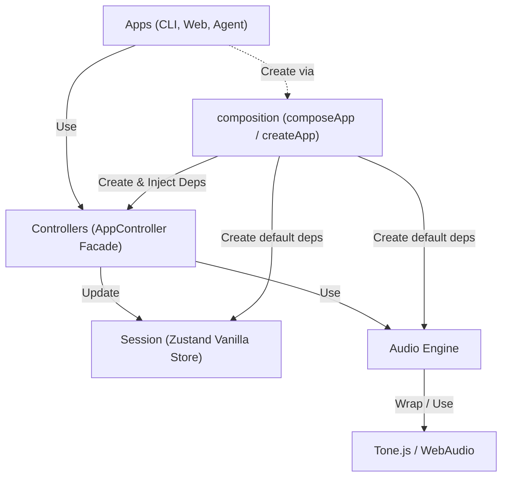

# 규칙

1. `audio-engine`은 `controllers`와 `composition`에서만 접근 가능하다.
2. 쓰기 가능한 `session` store는 `controllers`와 `composition`에서만 접근 가능하다.
3. `apps`는 `controllers`와 `composition`만 사용한다.
4. `apps`가 session을 읽어야 할 때는 `ISessionReader`처럼 읽기 전용 surface만 사용한다.
5. `tone.js` 혹은 그와 유사한 외부 오디오 라이브러리는 `audio-engine/tone` 같은 audio engine 구현 내부에서만 접근 가능하다.
6. UI에 반영되어야 하는 상태는 반드시 session에 업데이트되어야 한다. `audio-engine` 내부 상태만으로 UI state를 바꾸지 않는다.
7. `composeApp`은 이미 만들어진 의존성을 조립한다.
8. `createApp`은 기본 의존성을 생성한 뒤 `composeApp`에 넘기는 편의 factory다. 앱 로직은 갖지 않는다.
9. 제품 실행 경로에서는 실제 오디오 재생/export를 우선한다. `FakeAudioEngine`은 테스트와 격리된 개발 확인을 위한 구현체로 둔다.

## Architecture (Layers)

> **Note:** `records/` 디렉터리의 문서들은 마이그레이션 이전 구현 기록이다. 현재 아키텍처 가이드로 참고하지 않는다.
